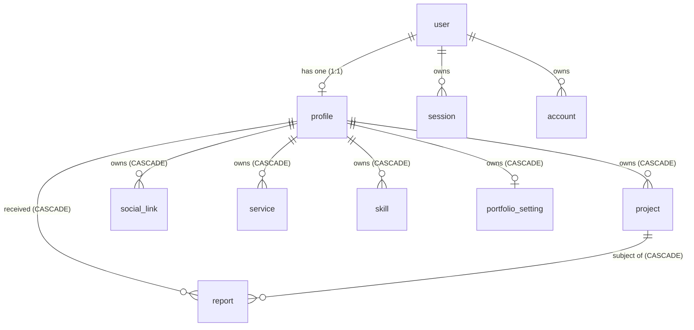

# Video Editor Portfolio Platform — System Architecture (V1.0 Locked)

**Document Type:** Technical Architecture Specification  
**Version:** V1.0 (Locked Baseline)  
**Status:** Locked & Approved for Design Phase  
**Product Name (Placeholder):** Reelify  

---

## 1. Core Architectural Tenet: Public Portfolio as a First-Class Domain

> **The public portfolio renderer is a first-class domain of the application, not merely a collection of reusable UI components.**

The entire product differentiator is visual and interactive excellence (Awwwards / creative studio benchmark). The architecture treats the presentation engine as an independent, high-fidelity rendering pipeline, decoupled from the CRUD operations of the creator dashboard.

```text
                           NEXT.JS 15 (APP ROUTER)
                                     │
        ┌────────────────────────────┼────────────────────────────┐
        ▼                            ▼                            ▼
  MARKETING & PUBLIC               APP / AUTH                 PORTFOLIO CORE
  ├── / (Landing)              ├── /signin (Google)         ├── /[username] (Public)
  ├── /pricing (Free tier)     ├── /onboarding (Wizard)     └── /[username]/work/[slug]
  ├── /about                   └── /dashboard
  └── /explore (Optional)          ├── /work
                                   ├── /profile
                                   ├── /design
                                   ├── /preview (Draft)
                                   └── /settings
        │                            │                            │
        └────────────────────────────┼────────────────────────────┘
                                     │
                         DOMAIN & SECURITY SERVICES
                                     │
           ┌─────────────────────────┴─────────────────────────┐
           ▼                                                   ▼
     BETTER AUTH                                      THEME & MEDIA ENGINE
     ├── Session Management                           ├── Theme Registry (Cinema, ...)
     ├── RBAC (Creator vs Admin)                      └── MediaProvider Strategy
     └── Server Guard Procedures                           (YouTube, Instagram, Drive)
                                     │
                                     ▼
                            DRIZZLE ORM (TYPED)
                                     │
                                     ▼
                           NEON POSTGRESQL (SERVERLESS)
```

---

## 2. Multi-Layer Security & Authorization Model

### 2.1 Principle: Middleware is NOT a Security Boundary
Middleware provides early URL interception, lightweight redirection, and cache invalidation. **It is never the final authorization boundary.**

```text
Incoming Request
       │
       ▼
[Layer 1: Edge Middleware]
       │  • Fast redirect if auth session token is missing for /dashboard/*, /onboarding, or /admin/*
       │  • Fast header stamping
       ▼
[Layer 2: Server-Side Session Verification]
       │  • Validate cryptographically with Better Auth in Server Action / Route Handler
       │  • Extract validated `user.id` and `user.role`
       ▼
[Layer 3: Profile Ownership & Role Verification]
       │  • Ensure `profile.user_id === session.user.id` (or `user.role === 'admin'`)
       ▼
[Layer 4: Resource Ownership Verification]
       │  • Verify targeted `project.profile_id === profile.id`
       ▼
[Layer 5: Database Mutation / Sensitive Read]
```

### 2.2 Reusable Server Action Guards
All protected actions wrap logic in typed server procedures:

```typescript
export async function requireAuth() {
  const session = await auth.api.getSession({ headers: await headers() });
  if (!session?.user) throw new UnauthorizedError("Authentication required");
  return session.user;
}

export async function requireProfileOwner(profileId: string) {
  const user = await requireAuth();
  const profile = await db.query.profiles.findFirst({
    where: eq(profiles.id, profileId),
  });
  if (!profile || profile.userId !== user.id) {
    throw new ForbiddenError("Not authorized to modify this profile");
  }
  return { user, profile };
}

export async function requireAdmin() {
  const user = await requireAuth();
  if (user.role !== "admin") {
    throw new ForbiddenError("Administrative privilege required");
  }
  return user;
}
```

---

## 3. Admin Authorization & Safe Bootstrap Architecture

### 3.1 Role Definition
Roles are explicitly stored on the Better Auth `user` entity:

```typescript
export type UserRole = "creator" | "admin";
```

* **Standard User Registration:** Always defaults strictly to `"creator"`.
* **Safe Admin Bootstrap:** Environment configuration must **never** silently promote an existing creator on standard deployments. Initial admin promotion happens strictly via:
  1. A one-time CLI seed script (`npm run db:seed-admin`), OR
  2. An explicit database bootstrap migration with strict email target checks.

### 3.2 Admin Routes & Capabilities
* `/admin` — Overview & moderation metrics
* `/admin/users` — List accounts, filter by role/status
* `/admin/profiles` — Inspect public portfolios, unpublish violation profiles
* `/admin/projects` — Content auditing
* `/admin/reports` — Review public complaints (spam, copyright, abuse)

Every admin route and server action strictly invokes `requireAdmin()`.

---

## 4. Media Architecture & Provider Abstraction

### 4.1 Zero Server-Side Scraping (No SSRF, No Fragility)
V1 strictly avoids server-side web fetching/scraping of external URLs:
* **No SSRF vectors:** The server never makes outbound HTTP requests to user-supplied URLs.
* **No external site dependency:** Portfolio rendering never breaks because Instagram or YouTube rate-limited our server IP.
* **Deterministic parsing:** Providers parse, validate, and construct canonical representations purely via URL parsing and regex pattern matching.

### 4.2 Explicit MediaProvider Interface

```typescript
export type MediaSourceType = "youtube" | "instagram" | "google_drive";

export interface MediaEmbedInfo {
  type: "iframe" | "card";
  embedUrl?: string;
  externalUrl: string;
  aspectRatio: "16:9" | "9:16" | "4:3" | "1:1";
  allowFullscreen?: boolean;
}

export interface MediaProvider {
  type: MediaSourceType;
  allowedHosts: string[];
  validate(url: URL): boolean;
  normalize(url: URL): string; // Canonical URL string
  extractId(url: URL): string | null;
  getEmbedInfo(canonicalUrl: string): MediaEmbedInfo;
  getDefaultThumbnailUrl?(id: string): string | null;
}
```

### 4.3 Provider Implementation Rules

#### 1. YouTube (`youtube.com`, `youtu.be`)
* **Detection:** Matches standard watch URLs, short links, and shorts.
* **Embed:** Produces responsive privacy-enhanced embed URL (`https://www.youtube-nocookie.com/embed/{id}`).
* **Thumbnail:** Provider reliably derives standard fallback thumbnail:
  `https://img.youtube.com/vi/{id}/hqdefault.jpg`.

#### 2. Instagram (`instagram.com`)
* **Detection:** Matches `/p/{id}`, `/reel/{id}`, `/tv/{id}`.
* **No Scraping / No API Token Requirement:** Does not attempt to fetch private Instagram Graph APIs or scrape thumbnails.
* **Behavior:** Renders a high-end editorial preview card displaying project metadata (title, category, tags) with an animated "Watch on Instagram" interaction. If the creator provides a validated custom thumbnail URL, it is used as the poster backdrop.

#### 3. Google Drive (`drive.google.com`)
* **Detection:** Matches `/file/d/{id}/view`, `/open?id={id}`.
* **Resilient Non-Blocking Presentation:**
  * Generates preview embed: `https://drive.google.com/file/d/{id}/preview`.
  * **Always-Available Direct Action:** The UI persistently renders a clean, accessible "Open in Google Drive" action alongside the player. Cross-origin iframe rendering failures or permission errors never block the visitor from accessing the work.

### 4.4 Strict URL Allowlist & Normalization

```typescript
export const ALLOWED_MEDIA_HOSTS = new Set([
  "youtube.com",
  "www.youtube.com",
  "m.youtube.com",
  "youtu.be",
  "instagram.com",
  "www.instagram.com",
  "drive.google.com",
]);
```

Any URL with an unlisted hostname or protocol other than `https:` is immediately rejected at the validation layer with user-friendly feedback.

---

## 5. Thumbnail Strategy & Visual Fallbacks

### 5.1 Strict V1 Thumbnail Priority Policy
To preserve the **zero-storage philosophy** while preventing arbitrary external image proxying or broken images:

1. **Provider-Derived Thumbnail:** Automatically derived where deterministic (e.g. YouTube standard CDN).
2. **Platform-Generated Editorial Poster:** High-contrast typographic poster generated dynamically using project title, category, and year.
3. **Optional User-Provided Image URL:** Allowed only if it passes strict validation:
   * Protocol must be `https:`
   * Host must be on an approved image CDN allowlist (e.g. `images.unsplash.com`, `cdn.sanity.io`, `lh3.googleusercontent.com`, `i.imgur.com`)
   * Reasonable URL length (< 1000 characters)
   * No server-side fetch or proxying.

### 5.2 Safe Image Rendering
* `next.config.ts` configures remote patterns for verified hostnames.
* Platform-generated typographic posters serve as the primary fallback, ensuring 100% render reliability without visual breakage.

---

## 6. Theme & Renderer Architecture

The visual presentation is separated into modular layers:

```text
src/features/portfolio/
├── types.ts                    # Shared PortfolioData interface
├── registry.ts                 # Theme lookup & metadata
├── renderer/
│   ├── portfolio-renderer.tsx  # Dynamic theme loader & error boundary
│   └── project-renderer.tsx    # Single project page renderer
├── shared/                     # Theme-agnostic logic & primitives
│   ├── media/
│   │   ├── media-embed.tsx     # Delegator to MediaProvider
│   │   ├── youtube-player.tsx
│   │   ├── drive-embed.tsx
│   │   └── instagram-card.tsx
│   ├── contact/
│   │   └── contact-drawer.tsx
│   └── transitions/
│       └── smooth-scroll.tsx
└── themes/
    ├── cinema/                 # Theme 1 (V1 Primary)
    │   ├── hero.tsx
    │   ├── showreel.tsx
    │   ├── work-showcase.tsx
    │   ├── project-detail.tsx
    │   ├── about.tsx
    │   ├── footer.tsx
    │   └── theme.css
    ├── editorial/              # Theme 2
    │   └── ...
    └── studio/                 # Theme 3
        └── ...
```

### 6.1 Shared Data Contract (`PortfolioData`)

```typescript
export interface PortfolioData {
  profile: {
    username: string;
    displayName: string;
    headline: string;
    bio: string | null;
    avatarUrl: string | null;
    location: string | null;
    availability: string | null;
    isPublished: boolean;
  };
  projects: Array<{
    id: string; // UUID
    slug: string;
    title: string;
    description: string | null;
    sourceType: MediaSourceType;
    sourceUrl: string;
    thumbnailUrl: string | null;
    category: string;
    client: string | null;
    year: string | null;
    featured: boolean;
    sortOrder: number;
  }>;
  services: Array<{ id: string; name: string }>;
  skills: Array<{ id: string; name: string }>;
  socialLinks: Array<{ id: string; platform: string; url: string }>;
  settings: {
    theme: "cinema" | "editorial" | "studio";
    motionLevel: "full" | "reduced";
    accentColor: string;
  };
}
```

---

## 7. Drafts, Previews, & Not-Found Lifecycle

### 7.1 State Resolution Table

| Route | Condition | System Behavior |
|-------|-----------|-----------------|
| `/[username]` | Profile exists + `is_published: true` | Render public theme with published projects only (`is_published: true`). |
| `/[username]` | Profile exists + `is_published: false` | Render custom `PortfolioNotPublished` view (emits HTTP 404 header for SEO protection). |
| `/[username]` | Profile does not exist | Render Next.js `notFound()`. |
| `/[username]/work/[slug]` | Project exists + both profile & project are published | Render public project page. |
| `/[username]/work/[slug]` | Project or profile unpublished | Render Next.js `notFound()`. |
| `/dashboard/preview` | Authenticated creator | Render **identical** theme renderer using draft data (includes unpublished projects, shows draft banner). |

---

## 8. Dedicated Application Route Architecture

```text
PUBLIC & MARKETING
├── /                          # Marketing Landing Page
├── /explore                   # Optional Directory / Creator Discovery
├── /pricing                   # Free Tier Showcase
├── /about                     # Platform Philosophy & Mission
└── /[username]                # Public Portfolio Surface
    └── /work/[slug]           # Public Project Deep-Dive

AUTHENTICATION & ONBOARDING
├── /signin                    # Google OAuth Single Action
└── /onboarding                # Guided 5-Step Setup Wizard
    ├── Step 1: Claim Username
    ├── Step 2: Basic Identity (Name, Headline)
    ├── Step 3: First Project URL
    ├── Step 4: Choose Visual Style (Cinema default)
    └── Step 5: Instant Live Preview & Publish

CREATOR CMS (DASHBOARD)
├── /dashboard                 # Overview, Public Status, Share Actions
├── /dashboard/work            # Project List & Ordering
│   ├── /new                   # Add Work Link Wizard
│   └── /[projectId]/edit      # Edit Project Details
├── /dashboard/profile         # Identity, Services, Skills, Socials
├── /dashboard/design          # Theme & Accent Selector
├── /dashboard/preview         # Full Interactive Draft Preview
└── /dashboard/settings        # Username change, Privacy, Account deletion

ADMINISTRATION
├── /admin                     # Dashboard & Quick Stats
├── /admin/users               # User Management
├── /admin/profiles            # Portfolio Moderation & Takedown
├── /admin/projects            # Content Inspection
└── /admin/reports             # Public Abuse & Copyright Queue
```

---

## 9. Username Policy & Lifecycle

1. **Validation:**
   * Length: 3 to 30 characters.
   * Pattern: `^[a-z0-9][a-z0-9_-]*[a-z0-9]$` (lowercase alphanumeric with hyphen/underscore, no consecutive special characters).
2. **Reserved Names:**
   * `admin`, `api`, `dashboard`, `login`, `signin`, `signup`, `pricing`, `explore`, `settings`, `about`, `work`, `terms`, `privacy`, `legal`, `help`, `contact`, `app`, `www`.
3. **Change Behavior:**
   * Creators can update their username in `/dashboard/settings`.
   * Clear confirmation modal informs creator that existing links in external bios will stop routing.
   * The previous username is released immediately upon successful update.

---

## 10. Database ID Strategy & Deterministic Slugs

* **Database Primary Keys:** Strict **UUID** (`uuidv4`) for all database primary keys and foreign keys.
* **Public Project URLs:** Generated via `slugify(title, { lower: true, strict: true })`.
* **Deterministic Slug Collisions:** Scoped per profile. When a collision occurs within the same profile, sequential numeric suffixes are appended:
  * First: `nike-campaign`
  * Second: `nike-campaign-2`
  * Third: `nike-campaign-3`

---

## 11. Serverless-Compatible Rate Limiting Strategy

To remain fully compatible with stateless serverless execution (Vercel/Neon) without introducing an external Redis dependency for V1:

* **Authentication Protection:** Managed natively by Better Auth's built-in security features.
* **Username Availability Checking:** Client-side 300ms debounce combined with server-side request throttling.
* **Authenticated Creator Mutations:** Database-backed count checks (e.g. project creation caps per user within rolling time windows).
* **Public Abuse Reports:** Database-backed throttling keyed on hashed IP (`reporter_ip_hash`), allowing a maximum of 5 reports per hour per IP.
* **Distributed KV/Redis:** Documented as an optional upgrade path when production scale warrants it.

---

## 12. Database Schema (V1 Scope Including Moderation Reports)



### Table Definitions (V1)
* `user`: `id (UUID PK)`, `email`, `name`, `role ('creator' | 'admin')`, `created_at`, `updated_at`
* `session`, `account`, `verification`: Better Auth standard schemas with UUID references
* `profiles`: `id (UUID PK)`, `user_id (UUID FK UNIQUE)`, `username (VARCHAR UNIQUE)`, `display_name`, `headline`, `bio`, `avatar_url`, `location`, `availability`, `is_published`, `created_at`, `updated_at`
* `projects`: `id (UUID PK)`, `profile_id (UUID FK)`, `slug (VARCHAR)`, `title`, `description`, `source_type ('youtube' | 'instagram' | 'google_drive')`, `source_url`, `thumbnail_url`, `category`, `client`, `year`, `featured (BOOLEAN)`, `is_published (BOOLEAN)`, `sort_order (INT)`, `created_at`, `updated_at`
  * Constraint: `UNIQUE(profile_id, slug)`
* `social_links`: `id (UUID PK)`, `profile_id (UUID FK)`, `platform`, `url`, `sort_order`
* `services`: `id (UUID PK)`, `profile_id (UUID FK)`, `name`, `sort_order`
* `skills`: `id (UUID PK)`, `profile_id (UUID FK)`, `name`, `sort_order`
* `portfolio_settings`: `id (UUID PK)`, `profile_id (UUID FK UNIQUE)`, `theme ('cinema' | 'editorial' | 'studio')`, `motion_level ('full' | 'reduced')`, `accent_color`
* `reports`: `id (UUID PK)`, `reporter_ip_hash (VARCHAR)`, `profile_id (UUID FK)`, `project_id (UUID FK NULLABLE)`, `reason ('spam' | 'copyright' | 'inappropriate' | 'impersonation' | 'other')`, `description`, `status ('pending' | 'resolved' | 'dismissed')`, `resolved_by (UUID FK NULLABLE)`, `resolved_at (TIMESTAMP NULLABLE)`, `created_at (TIMESTAMP)`

### Cascade Policy
When a `user` is deleted:
* `profile` is deleted (`ON DELETE CASCADE`).
* Deleting `profile` cascades and deletes all related projects, social links, services, skills, portfolio settings, and reports.

---

## 13. Build Sequence & Milestones

```text
Phase 1: Foundation
  1. Next.js 15 App Router + Tailwind setup (Complete)
  2. Better Auth + Drizzle ORM + Neon PostgreSQL setup
  3. Complete V1 database schema creation (including reports) + migrations
  4. Typed Server Action infrastructure & guard helpers (requireAuth, requireProfileOwner, requireAdmin)

Phase 2: Authentication & Onboarding
  1. Google OAuth sign-in flow (/signin)
  2. Dedicated 5-step onboarding wizard (/onboarding)
  3. Session management & route protection

Phase 3: Core Public Product (Cinema Theme First)
  1. Portfolio data query helpers
  2. MediaProvider engine (YouTube, Instagram card, Google Drive persistent direct action)
  3. Cinema Theme implementation (Editorial hero, showreel, asymmetric work grid, project details)
  4. Public portfolio routes (/[username] & /[username]/work/[slug])

Phase 4: Dashboard & Creator CMS
  1. /dashboard overview with live status & share links
  2. /dashboard/work project management (CRUD, reordering, published/featured toggles)
  3. /dashboard/profile editor (bio, avatar, services, skills, socials)
  4. /dashboard/design live theme & accent selector
  5. /dashboard/preview integrated draft renderer
  6. /dashboard/settings (username change, visibility, account deletion)

Phase 5: Marketing & Public Surfaces
  1. High-converting Landing Page (Hero showcase, problem/solution, themes preview, FAQ, CTA)
  2. /pricing (V1 transparent free tier)
  3. /about
  4. /explore (basic launch directory)

Phase 6: Moderation & Secondary Themes
  1. /admin moderation panel (Users, profiles, projects, reports queue)
  2. Secondary themes: Editorial & Studio
  3. Dynamic OpenGraph metadata, smooth scroll, responsive mobile polish pass
```

---

## 14. Architecture Approval & Sign-Off

This specification is **LOCKED (V1.0)**. It serves as the definitive engineering contract for all subsequent design and development phases.
