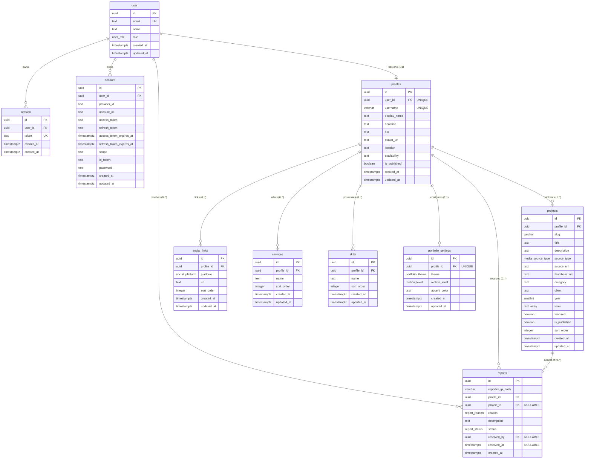

# Reelify — Database Architecture & Schema Specification (V1.0 Locked)

**Document Type:** Database Architecture & Persistence Contract  
**Version:** V1.0 (Locked Baseline)  
**Status:** Approved & Locked for Implementation  
**Target Engine:** Neon Serverless PostgreSQL  
**ORM:** Drizzle ORM (TypeScript)  
**Auth Layer:** Better Auth  
**Product Name (Placeholder):** Reelify  

---

## 1. Core Database Principles & Invariants

1. **Relational Rigor Over Application Assumptions:** The database is the final authority on data integrity. Important invariants (uniqueness, composite foreign keys, cascade rules, valid enums, string boundaries, trigger-based immutability, and state consistency) are enforced via native PostgreSQL constraints and database triggers, not duplicated solely in application logic.
2. **Strict Identity Unification (UUID):** All primary keys and foreign keys across both Better Auth and application tables use standard PostgreSQL `UUID` (`gen_random_uuid()`). Numeric auto-increments and NanoIDs are strictly prohibited in the persistence layer.
3. **Deterministic Timestamps & Enforced Triggers:** All timestamps use `TIMESTAMPTZ` in UTC. `created_at` is immutable; `updated_at` is strictly maintained via an automated PostgreSQL `BEFORE UPDATE` trigger across all editable application tables.
4. **Zero Video Binaries:** The database stores portfolio metadata, canonical external URLs, and theme configuration. No video files, binary blobs, or transcoded media chunks exist within the database.
5. **Zero Fake Production Data:** The production database must never contain synthetic or placeholder records (*no demo users, no fabricated portfolios, no sample clients*). Development fixtures are strictly isolated from production migrations and deployment scripts.

---

## 2. Better Auth Configuration & Role Contract

Better Auth manages identity, session tokens, and OAuth account linkage. To ensure architectural integrity and prevent security bypasses, Better Auth's schema is configured to use native `UUID` identifiers, enforces token encryption, aligns with singular table names, and defines role boundaries strictly through `user.additionalFields` with `input: false`.

### 2.1 Better Auth Server Configuration Contract

```typescript
// Conceptual Better Auth configuration in src/lib/auth.ts
import { betterAuth } from "better-auth";
import { drizzleAdapter } from "@better-auth/drizzle-adapter";
import { db } from "@/db";

export const auth = betterAuth({
  database: drizzleAdapter(db, {
    provider: "pg",
    usePlural: false, // Core auth tables are singular: user, session, account, verification
  }),
  advanced: {
    database: {
      generateId: false, // Relies on Postgres native gen_random_uuid()
    },
  },
  account: {
    encryptOAuthTokens: true, // Enables server-side AES encryption for OAuth tokens
  },
  user: {
    additionalFields: {
      role: {
        type: "string", // Backed authoritatively by Postgres user_role ENUM
        required: false,
        defaultValue: "creator",
        input: false, // CRITICAL: Prevents client mutation or assignment during signup/update
      },
    },
  },
  socialProviders: {
    google: {
      clientId: process.env.GOOGLE_CLIENT_ID!,
      clientSecret: process.env.GOOGLE_CLIENT_SECRET!,
    },
  },
});
```

* **Zero Self-Promotion:** Normal authentication endpoints cannot assign or modify the `role` field.
* **Database-Enforced Roles:** Better Auth treats `role` as an unwriteable string, while PostgreSQL enforces the native `user_role` ENUM (`'creator' | 'admin'`).
* **Safe Admin Bootstrap:** Admin accounts are created strictly via:
  1. A one-time CLI seed script (`npm run db:seed-admin`) checking explicit environment targets, OR
  2. Manual administrative SQL execution in the Neon Console.

### 2.2 Separation of User vs. Profile
* **`user` Table:** Represents *Authentication & Security Identity* (email, role, session).
* **`profiles` Table:** Represents *Creator & Public Portfolio Identity* (username, headline, bio, avatar, published state).
* These concerns are strictly decoupled into a 1:1 relationship (`profiles.user_id UNIQUE`).

---

## 3. Entity-Relationship Model (Master ERD)

All entity names in the ERD correspond strictly to the exact PostgreSQL table names.



---

## 4. Master Table Reference

| Table | Domain / Purpose | Ownership | Record Count Estimate | V1 Scope |
|---|---|---|---|---|
| `user` | Authentication identity & role | Better Auth | 1 per creator / admin | **Yes** |
| `session` | Active authentication sessions | Better Auth | 1–5 per active user | **Yes** |
| `account` | OAuth provider link (Google) | Better Auth | 1 per user | **Yes** |
| `verification` | Auth token verification | Better Auth | Ephemeral | **Yes** |
| `profiles` | Public creator identity & URL slug | Creator | 1 per user (1:1) | **Yes** |
| `projects` | Video editor work showcase items | Creator | 1–50 per profile | **Yes** |
| `social_links` | External social/profile links | Creator | 1–8 per profile | **Yes** |
| `services` | Commercial offerings | Creator | 1–12 per profile | **Yes** |
| `skills` | Software & technical competencies | Creator | 1–20 per profile | **Yes** |
| `portfolio_settings` | Art direction & theme options | Creator | 1 per profile (1:1) | **Yes** |
| `reports` | Moderation & abuse reports | Public / Admin | Variable | **Yes** |

---

## 5. Detailed Table Specifications & Column Contracts

### 5.1 Enums (PostgreSQL Types)

```sql
CREATE TYPE user_role AS ENUM ('creator', 'admin');
CREATE TYPE media_source_type AS ENUM ('youtube', 'instagram', 'google_drive');
CREATE TYPE social_platform AS ENUM ('instagram', 'youtube', 'linkedin', 'x', 'whatsapp', 'website');
CREATE TYPE portfolio_theme AS ENUM ('cinema', 'editorial', 'studio');
CREATE TYPE motion_level AS ENUM ('full', 'reduced');
CREATE TYPE report_reason AS ENUM ('spam', 'copyright', 'inappropriate', 'impersonation', 'other');
CREATE TYPE report_status AS ENUM ('pending', 'resolved', 'dismissed');
```

---

### 5.2 Table: `user`

Managed by Better Auth with custom UUID and role extensions.

| Column | PostgreSQL Type | Nullable | Default | Constraints | Description |
|---|---|---|---|---|---|
| `id` | `UUID` | No | `gen_random_uuid()` | Primary Key | Global internal user identifier. |
| `email` | `TEXT` | No | None | Unique, Check format | Verified Google account email address. |
| `name` | `TEXT` | No | None | Length <= 100 | Full name retrieved from Google OAuth (Required). |
| `email_verified`| `BOOLEAN`| No | `false` | None | Stamped true upon Google OAuth callback. |
| `image` | `TEXT` | Yes | None | Length <= 1000 | User avatar URL from Google OAuth. |
| `role` | `user_role` | No | `'creator'` | Enum | Access control tier (`creator` or `admin`). |
| `created_at` | `TIMESTAMPTZ` | No | `now()` | Immutable | Account registration timestamp (UTC). |
| `updated_at` | `TIMESTAMPTZ` | No | `now()` | Trigger | Timestamp of last user record modification. |

---

### 5.3 Table: `session`

| Column | PostgreSQL Type | Nullable | Default | Constraints | Description |
|---|---|---|---|---|---|
| `id` | `UUID` | No | `gen_random_uuid()` | Primary Key | Session identifier. |
| `user_id` | `UUID` | No | None | FK `user.id` CASCADE | Authenticated session owner. |
| `token` | `TEXT` | No | None | Unique | Secure cryptographic session bearer token. |
| `expires_at` | `TIMESTAMPTZ` | No | None | None | Session expiry timestamp. |
| `ip_address` | `TEXT` | Yes | None | Length <= 45 | Optional client IP logging. |
| `user_agent` | `TEXT` | Yes | None | Length <= 500 | Optional client User-Agent string. |
| `created_at` | `TIMESTAMPTZ` | No | `now()` | Immutable | Timestamp of session initiation. |
| `updated_at` | `TIMESTAMPTZ` | No | `now()` | Trigger | Timestamp of last session refresh. |

---

### 5.4 Table: `account`

Reconciled with official Better Auth specification (distinct access/refresh expiry fields).

| Column | PostgreSQL Type | Nullable | Default | Constraints | Description |
|---|---|---|---|---|---|
| `id` | `UUID` | No | `gen_random_uuid()` | Primary Key | Account linkage record identifier. |
| `user_id` | `UUID` | No | None | FK `user.id` CASCADE | User record associated with OAuth identity. |
| `account_id` | `TEXT` | No | None | None | External provider account ID (Google Sub ID). |
| `provider_id` | `TEXT` | No | None | None | OAuth provider identifier (`google`). |
| `access_token`| `TEXT` | Yes | None | None | AES-encrypted OAuth access token. |
| `refresh_token`| `TEXT` | Yes | None | None | AES-encrypted OAuth refresh token. |
| `access_token_expires_at`| `TIMESTAMPTZ`| Yes | None | None | Specific expiry for access token. |
| `refresh_token_expires_at`| `TIMESTAMPTZ`| Yes | None | None | Specific expiry for refresh token. |
| `scope` | `TEXT` | Yes | None | None | Granted OAuth scope permissions. |
| `id_token` | `TEXT` | Yes | None | None | OpenID Connect token. |
| `password` | `TEXT` | Yes | None | None | Null for OAuth providers. |
| `created_at` | `TIMESTAMPTZ` | No | `now()` | Immutable | Account linkage creation timestamp. |
| `updated_at` | `TIMESTAMPTZ` | No | `now()` | Trigger | Account linkage update timestamp. |

#### Database Constraints on `account`:
```sql
ALTER TABLE account ADD CONSTRAINT uq_account_provider_account 
UNIQUE (provider_id, account_id);
```

---

### 5.5 Table: `verification`

| Column | PostgreSQL Type | Nullable | Default | Constraints | Description |
|---|---|---|---|---|---|
| `id` | `UUID` | No | `gen_random_uuid()` | Primary Key | Verification record identifier. |
| `identifier` | `TEXT` | No | None | None | Target email or action identity. |
| `value` | `TEXT` | No | None | None | Cryptographic verification hash/nonce. |
| `expires_at` | `TIMESTAMPTZ` | No | None | None | Nonce expiry timestamp. |
| `created_at` | `TIMESTAMPTZ` | No | `now()` | Immutable | Verification record issuance timestamp. |
| `updated_at` | `TIMESTAMPTZ` | No | `now()` | Trigger | Record refresh timestamp. |

---

### 5.6 Table: `profiles`

| Column | PostgreSQL Type | Nullable | Default | Constraints | Description |
|---|---|---|---|---|---|
| `id` | `UUID` | No | `gen_random_uuid()` | Primary Key | Internal profile identifier. |
| `user_id` | `UUID` | No | None | FK `user.id` CASCADE, UNIQUE | Enforces strict 1:1 relationship with user. |
| `username` | `VARCHAR(30)` | No | None | UNIQUE, CHECK regex | Public URL identifier (`platform.com/[username]`). |
| `display_name` | `VARCHAR(100)` | No | None | Length >= 2 | Creator professional name (e.g. `Mahesh CH`). |
| `headline` | `VARCHAR(120)` | No | None | Length >= 2 | Primary title (e.g. `Commercial & Music Video Editor`). |
| `bio` | `TEXT` | Yes | None | Length <= 1000 | Editorial bio / creative statement. |
| `avatar_url` | `TEXT` | Yes | None | Length <= 1000 | Profile photo URL (Google or custom link). |
| `location` | `VARCHAR(80)` | Yes | None | Length <= 80 | Creator home base (e.g. `Mumbai, India`). |
| `availability`| `VARCHAR(60)` | Yes | None | Length <= 60 | Status badge text (e.g. `Available for Work`). |
| `is_published`| `BOOLEAN` | No | `false` | None | Controls public visibility at `/[username]`. |
| `created_at` | `TIMESTAMPTZ` | No | `now()` | Immutable | Profile creation timestamp. |
| `updated_at` | `TIMESTAMPTZ` | No | `now()` | Trigger | Last profile edit timestamp. |

#### Database Constraints on `profiles`:
```sql
ALTER TABLE profiles ADD CONSTRAINT chk_username_format 
CHECK (username ~ '^[a-z0-9][a-z0-9_-]{1,28}[a-z0-9]$');

ALTER TABLE profiles ADD CONSTRAINT chk_username_lowercase 
CHECK (username = lower(username));
```

---

### 5.7 Table: `projects`

Showcase items representing a creator's video edits.

| Column | PostgreSQL Type | Nullable | Default | Constraints | Description |
|---|---|---|---|---|---|
| `id` | `UUID` | No | `gen_random_uuid()` | Primary Key | Internal project identifier. |
| `profile_id` | `UUID` | No | None | FK `profiles.id` CASCADE | Profile owning this project. |
| `slug` | `VARCHAR(100)` | No | None | Unique per profile, CHECK slug | URL slug (`/[username]/work/[slug]`). |
| `title` | `VARCHAR(140)` | No | None | Length >= 1 | Project title (e.g. `Nike — Faster Than Light`). |
| `description` | `TEXT` | Yes | None | Length <= 4000 | Project narrative, case study text. |
| `source_type` | `media_source_type` | No | None | Enum | Provider (`youtube`, `instagram`, `google_drive`). |
| `source_url` | `TEXT` | No | None | Length <= 1000 | Canonical external media URL. |
| `thumbnail_url`| `TEXT` | Yes | None | Length <= 1000 | External custom poster or derived thumbnail URL. |
| `category` | `VARCHAR(60)` | No | None | Length >= 1 | Project genre (e.g. `Commercial`, `Music Video`). |
| `client` | `VARCHAR(80)` | Yes | None | Length <= 80 | Client or production studio name. |
| `year` | `SMALLINT` | Yes | None | `year BETWEEN 1990 AND 2100` | Release or production year. |
| `tools` | `TEXT[]` | No | `'{}'` | None | Array of software/hardware tools used. |
| `featured` | `BOOLEAN` | No | `false` | None | Priority highlight (e.g. Showreel / Hero spot). |
| `is_published`| `BOOLEAN` | No | `false` | None | Individual project publish status. |
| `published_at` | `TIMESTAMPTZ` | Yes | None | None | First publication timestamp (frozen permanently once set). |
| `sort_order` | `INTEGER` | No | `0` | `sort_order >= 0` | Display rank in creator portfolio. |
| `created_at` | `TIMESTAMPTZ` | No | `now()` | Immutable | Project record creation timestamp. |
| `updated_at` | `TIMESTAMPTZ` | No | `now()` | Trigger | Last project edit timestamp. |

#### Database Constraints on `projects`:
```sql
ALTER TABLE projects ADD CONSTRAINT uq_profile_project_slug 
UNIQUE (profile_id, slug);

ALTER TABLE projects ADD CONSTRAINT uq_projects_id_profile 
UNIQUE (id, profile_id); -- Enables composite foreign key from reports

ALTER TABLE projects ADD CONSTRAINT chk_project_slug_format 
CHECK (slug ~ '^[a-z0-9]+(-[a-z0-9]+)*$');

ALTER TABLE projects ADD CONSTRAINT chk_project_year_range 
CHECK (year IS NULL OR (year >= 1990 AND year <= 2100));

ALTER TABLE projects ADD CONSTRAINT chk_project_sort_order_positive 
CHECK (sort_order >= 0);
```

#### Slug Lifecycle & Immutability Contract:
1. **Creation:** Slugs are generated from the project title via `slugify(title, { lower: true, strict: true })`.
2. **Draft State:** The slug may be modified while the project is in draft (`is_published: false`).
3. **Published Immutability Enforced via Trigger:** Once a project has been published, any update that changes its `slug` is rejected at the database level by the project update trigger (see Section 6).

---

### 5.8 Table: `social_links`

External social and professional links.

| Column | PostgreSQL Type | Nullable | Default | Constraints | Description |
|---|---|---|---|---|---|
| `id` | `UUID` | No | `gen_random_uuid()` | Primary Key | Link record identifier. |
| `profile_id` | `UUID` | No | None | FK `profiles.id` CASCADE | Profile owning this link. |
| `platform` | `social_platform` | No | None | Enum | Target network. |
| `url` | `TEXT` | No | None | Length <= 500, `https://` | External profile destination. |
| `sort_order` | `INTEGER` | No | `0` | `sort_order >= 0` | Horizontal display sequence. |
| `created_at` | `TIMESTAMPTZ` | No | `now()` | Immutable | Record creation timestamp. |
| `updated_at` | `TIMESTAMPTZ` | No | `now()` | Trigger | Record modification timestamp. |

#### Database Constraints on `social_links`:
```sql
ALTER TABLE social_links ADD CONSTRAINT uq_profile_platform 
UNIQUE (profile_id, platform);

ALTER TABLE social_links ADD CONSTRAINT chk_social_url_https 
CHECK (url ~* '^https://');
```

---

### 5.9 Table: `services`

| Column | PostgreSQL Type | Nullable | Default | Constraints | Description |
|---|---|---|---|---|---|
| `id` | `UUID` | No | `gen_random_uuid()` | Primary Key | Service record identifier. |
| `profile_id` | `UUID` | No | None | FK `profiles.id` CASCADE | Profile offering this service. |
| `name` | `VARCHAR(80)` | No | None | Length >= 2 | Service title (e.g. `Short-form Social Editing`). |
| `sort_order` | `INTEGER` | No | `0` | `sort_order >= 0` | Display rank. |
| `created_at` | `TIMESTAMPTZ` | No | `now()` | Immutable | Record creation timestamp. |
| `updated_at` | `TIMESTAMPTZ` | No | `now()` | Trigger | Record modification timestamp. |

---

### 5.10 Table: `skills`

| Column | PostgreSQL Type | Nullable | Default | Constraints | Description |
|---|---|---|---|---|---|
| `id` | `UUID` | No | `gen_random_uuid()` | Primary Key | Skill record identifier. |
| `profile_id` | `UUID` | No | None | FK `profiles.id` CASCADE | Profile possessing this skill. |
| `name` | `VARCHAR(60)` | No | None | Length >= 1 | Skill tag (e.g. `Color Grading`, `After Effects`). |
| `sort_order` | `INTEGER` | No | `0` | `sort_order >= 0` | Display rank. |
| `created_at` | `TIMESTAMPTZ` | No | `now()` | Immutable | Record creation timestamp. |
| `updated_at` | `TIMESTAMPTZ` | No | `now()` | Trigger | Record modification timestamp. |

---

### 5.11 Table: `portfolio_settings`

| Column | PostgreSQL Type | Nullable | Default | Constraints | Description |
|---|---|---|---|---|---|
| `id` | `UUID` | No | `gen_random_uuid()` | Primary Key | Settings identifier. |
| `profile_id` | `UUID` | No | None | FK `profiles.id` CASCADE, UNIQUE | Enforces strict 1:1 with profile. |
| `theme` | `portfolio_theme` | No | `'cinema'` | Enum | Active theme renderer (`cinema`, `editorial`, `studio`). |
| `motion_level` | `motion_level` | No | `'full'` | Enum | Motion intensity (`full` or `reduced`). |
| `accent_color` | `VARCHAR(7)` | No | `'#E5E5E5'` | CHECK hex color | Hex accent code (Cinema default `#E5E5E5`). |
| `created_at` | `TIMESTAMPTZ` | No | `now()` | Immutable | Settings creation timestamp. |
| `updated_at` | `TIMESTAMPTZ` | No | `now()` | Trigger | Settings modification timestamp. |

#### Database Constraints on `portfolio_settings`:
```sql
ALTER TABLE portfolio_settings ADD CONSTRAINT chk_accent_hex_format 
CHECK (accent_color ~* '^#[0-9a-f]{6}$');
```

---

### 5.12 Table: `reports`

Public abuse, spam, and copyright reports handled by platform administrators.

| Column | PostgreSQL Type | Nullable | Default | Constraints | Description |
|---|---|---|---|---|---|
| `id` | `UUID` | No | `gen_random_uuid()` | Primary Key | Report ticket identifier. |
| `reporter_ip_hash`| `VARCHAR(64)` | No | None | Length = 64 | HMAC-SHA256 salted hash of reporter's IP. |
| `profile_id` | `UUID` | No | None | FK `profiles.id` CASCADE | Target profile reported. |
| `project_id` | `UUID` | Yes | None | Composite FK | Specific project reported (optional). |
| `reason` | `report_reason` | No | None | Enum | Category (`spam`, `copyright`, etc.). |
| `description` | `TEXT` | Yes | None | Length <= 2000 | Reporter's written explanation. |
| `status` | `report_status` | No | `'pending'` | Enum | Lifecycle state (`pending`, `resolved`, `dismissed`). |
| `resolved_by` | `UUID` | Yes | None | FK `user.id` SET NULL | Admin user ID who reviewed ticket. |
| `resolved_at` | `TIMESTAMPTZ` | Yes | None | None | Resolution timestamp. |
| `created_at` | `TIMESTAMPTZ` | No | `now()` | Immutable | Ticket submission timestamp. |

#### Composite Foreign Key Integrity (NO ACTION + Pre-Delete Trigger):
To guarantee that a report cannot reference `Profile A` while targeting a `project_id` belonging to `Profile B`, `reports` enforces a composite foreign key referencing `projects(id, profile_id)`. Because `reports.profile_id` is `NOT NULL`, native `ON DELETE SET NULL` on the composite foreign key would fail. We therefore specify `ON DELETE NO ACTION` on the composite constraint, accompanied by a dedicated project-delete trigger that safely decouples the project before row deletion (see Section 6).

```sql
ALTER TABLE reports ADD CONSTRAINT fk_reports_project_profile
FOREIGN KEY (project_id, profile_id) 
REFERENCES projects(id, profile_id) 
ON DELETE NO ACTION;
```

#### Report Lifecycle State Invariants (Safe for Admin Account Deletion):
```sql
ALTER TABLE reports ADD CONSTRAINT chk_report_resolution_consistency
CHECK (
  (status = 'pending' AND resolved_by IS NULL AND resolved_at IS NULL)
  OR
  (status IN ('resolved', 'dismissed') AND resolved_at IS NOT NULL)
);
```
*(This allows `resolved_by` to become NULL if the reviewing administrator user account is ever deleted, while guaranteeing that `resolved_at` remains recorded).*

---

## 6. PostgreSQL Trigger Infrastructure

To fulfill the core principle that the database is the final authority on data integrity, automated triggers enforce timestamp maintenance, project-report decoupling, and published slug immutability.

### 6.1 Standard `updated_at` Trigger

```sql
CREATE OR REPLACE FUNCTION update_updated_at_column()
RETURNS TRIGGER AS $$
BEGIN
    NEW.updated_at = now();
    RETURN NEW;
END;
$$ LANGUAGE plpgsql;

-- Apply trigger across standard mutable tables
CREATE TRIGGER trg_user_updated_at BEFORE UPDATE ON "user" FOR EACH ROW EXECUTE FUNCTION update_updated_at_column();
CREATE TRIGGER trg_account_updated_at BEFORE UPDATE ON "account" FOR EACH ROW EXECUTE FUNCTION update_updated_at_column();
CREATE TRIGGER trg_session_updated_at BEFORE UPDATE ON "session" FOR EACH ROW EXECUTE FUNCTION update_updated_at_column();
CREATE TRIGGER trg_profiles_updated_at BEFORE UPDATE ON "profiles" FOR EACH ROW EXECUTE FUNCTION update_updated_at_column();
CREATE TRIGGER trg_social_links_updated_at BEFORE UPDATE ON "social_links" FOR EACH ROW EXECUTE FUNCTION update_updated_at_column();
CREATE TRIGGER trg_services_updated_at BEFORE UPDATE ON "services" FOR EACH ROW EXECUTE FUNCTION update_updated_at_column();
CREATE TRIGGER trg_skills_updated_at BEFORE UPDATE ON "skills" FOR EACH ROW EXECUTE FUNCTION update_updated_at_column();
CREATE TRIGGER trg_portfolio_settings_updated_at BEFORE UPDATE ON "portfolio_settings" FOR EACH ROW EXECUTE FUNCTION update_updated_at_column();
```

### 6.2 Projects Specialized Update Trigger (Slug Immutability + `published_at` + `updated_at`)

```sql
CREATE OR REPLACE FUNCTION trg_projects_update_fn()
RETURNS TRIGGER AS $$
BEGIN
    -- Enforce published slug immutability if the project has ever been published
    IF OLD.published_at IS NOT NULL AND NEW.slug <> OLD.slug THEN
        RAISE EXCEPTION 'Published project slug is strictly immutable (slug: %)', OLD.slug;
    END IF;
    
    -- Stamp published_at permanently on first publication
    IF OLD.published_at IS NULL AND NEW.is_published = true THEN
        NEW.published_at = now();
    END IF;

    NEW.updated_at = now();
    RETURN NEW;
END;
$$ LANGUAGE plpgsql;

CREATE TRIGGER trg_projects_update
BEFORE UPDATE ON "projects"
FOR EACH ROW
EXECUTE FUNCTION trg_projects_update_fn();
```

### 6.3 Projects Pre-Delete Trigger (Safe Report Decoupling)

```sql
CREATE OR REPLACE FUNCTION trg_projects_pre_delete_fn()
RETURNS TRIGGER AS $$
BEGIN
    -- Safely decouple reports targeting this project before row deletion
    UPDATE reports 
    SET project_id = NULL 
    WHERE project_id = OLD.id;
    
    RETURN OLD;
END;
$$ LANGUAGE plpgsql;

CREATE TRIGGER trg_projects_pre_delete
BEFORE DELETE ON "projects"
FOR EACH ROW
EXECUTE FUNCTION trg_projects_pre_delete_fn();
```

---

## 7. Cascade Policies & Relationship Integrity

```text
┌─────────────────┐
│     user        │
└────────┬────────┘
         │
         ├─── (CASCADE) ──► session
         ├─── (CASCADE) ──► account
         ├─── (CASCADE) ──► profiles
         │                    │
         │                    ├─── (CASCADE) ──► projects
         │                    │                    │
         │                    │                    └─── (TRIGGER SET NULL) ──► reports(project_id)
         │                    ├─── (CASCADE) ──► social_links
         │                    ├─── (CASCADE) ──► services
         │                    ├─── (CASCADE) ──► skills
         │                    ├─── (CASCADE) ──► portfolio_settings
         │                    └─── (CASCADE) ──► reports.profile_id
         │
         └──────────────────────── (SET NULL) ──► reports.resolved_by
```

### Master Foreign Key & Deletion Matrix

| Parent Table | Child Table | Foreign Key Column | On Delete Action | On Update Action | Architectural Rationale |
|---|---|---|---|---|---|
| `user` | `session` | `session.user_id` | **CASCADE** | **CASCADE** | User removal destroys all active auth tokens. |
| `user` | `account` | `account.user_id` | **CASCADE** | **CASCADE** | User removal unlinks OAuth credentials. |
| `user` | `profiles` | `profiles.user_id` | **CASCADE** | **CASCADE** | User deletion completely removes their public portfolio. |
| `profiles` | `projects` | `projects.profile_id` | **CASCADE** | **CASCADE** | Portfolio removal destroys all showcase work. |
| `profiles` | `social_links` | `social_links.profile_id` | **CASCADE** | **CASCADE** | Portfolio removal destroys all social references. |
| `profiles` | `services` | `services.profile_id` | **CASCADE** | **CASCADE** | Portfolio removal destroys service offerings. |
| `profiles` | `skills` | `skills.profile_id` | **CASCADE** | **CASCADE** | Portfolio removal destroys skill tags. |
| `profiles` | `portfolio_settings` | `portfolio_settings.profile_id` | **CASCADE** | **CASCADE** | Portfolio removal destroys theme config. |
| `profiles` | `reports` | `reports.profile_id` | **CASCADE** | **CASCADE** | Profile removal cleans up associated moderation queues. |
| `projects` | `reports` | `reports(project_id, profile_id)` | **NO ACTION** | **CASCADE** | Project pre-delete trigger sets `reports.project_id = NULL`, preserving profile-level moderation history. |
| `user` | `reports` | `reports.resolved_by` | **SET NULL** | **CASCADE** | If an admin user account is removed, moderation history is preserved with null reviewer reference. |

---

## 8. Indexing Strategy & Performance Engineering

Redundant indexes that duplicate `PRIMARY KEY` or `UNIQUE` constraints (e.g. on `profiles.username`, `user.email`, `session.token`, `profiles.user_id`, or `projects(profile_id, slug)`) are **strictly eliminated**. PostgreSQL automatically backs every unique constraint with an internal B-Tree index.

Separate indexes are declared solely for non-unique relational lookups and serverless throttling.

| Index Identifier | Target Table | Indexed Columns | Index Type | Target Query Pattern & Rationale |
|---|---|---|---|---|
| `idx_projects_lookup` | `projects` | `(profile_id, is_published, sort_order)` | `BTREE` | **Index-assisted ordered lookup:** Resolves published projects for public portfolio requests. |
| `idx_projects_featured` | `projects` | `(profile_id, featured)` | `BTREE` | Fast query for hero showreel or featured section. |
| `idx_social_links_order`| `social_links` | `(profile_id, sort_order)` | `BTREE` | Fetches ordered social links for public footer dock. |
| `idx_services_order` | `services` | `(profile_id, sort_order)` | `BTREE` | Fetches ordered services for portfolio about section. |
| `idx_skills_order` | `skills` | `(profile_id, sort_order)` | `BTREE` | Fetches ordered skills tags for portfolio about section. |
| `idx_reports_moderation`| `reports` | `(status, created_at DESC)` | `BTREE` | Admin queue view: filters pending reports ordered by recency. |
| `idx_reports_throttle` | `reports` | `(reporter_ip_hash, created_at)` | `BTREE` | **Serverless Throttling Query:** Counts recent submissions per IP hash without Redis (`created_at > now() - INTERVAL '1 hour'`). |

---

## 9. Query Patterns & Data Access Boundaries

### 9.1 Public Portfolio Query (Zero Internal UUID Exposure, Zero N+1)

Internal database UUIDs are stripped from the public projection to maintain strict clean domain boundaries.

```typescript
// Conceptual Drizzle Query for `/[username]`
export async function getPublicPortfolio(username: string) {
  return await db.query.profiles.findFirst({
    where: and(
      eq(profiles.username, username.toLowerCase()),
      eq(profiles.is_published, true)
    ),
    columns: {
      username: true,
      displayName: true,
      headline: true,
      bio: true,
      avatarUrl: true,
      location: true,
      availability: true,
    },
    with: {
      settings: {
        columns: {
          theme: true,
          motionLevel: true,
          accentColor: true,
        },
      },
      projects: {
        where: eq(projects.is_published, true),
        orderBy: [asc(projects.sortOrder), desc(projects.createdAt)],
        columns: {
          slug: true, // Public identifier
          title: true,
          description: true,
          sourceType: true,
          sourceUrl: true,
          thumbnailUrl: true,
          category: true,
          client: true,
          year: true,
          tools: true,
          featured: true,
          sortOrder: true,
        },
      },
      socialLinks: {
        orderBy: [asc(socialLinks.sortOrder)],
        columns: { platform: true, url: true },
      },
      services: {
        orderBy: [asc(services.sortOrder)],
        columns: { name: true },
      },
      skills: {
        orderBy: [asc(skills.sortOrder)],
        columns: { name: true },
      },
    },
  });
}
```

### 9.2 Security Boundary: Public vs. Private Projections
* **Never Projected to Public Clients:**
  * `user.*` (Email, OAuth tokens, role, security credentials).
  * `session.*` (Session bearer tokens, IP address, user-agent).
  * `reports.*` (Abuse tickets, reporter IP hashes).
  * `projects.id`, `profiles.id` (Internal database primary keys).
  * Internal unpublished draft projects when requesting the public route.

---

## 10. Concurrency, Race Conditions & Deterministic Ordering

### 10.1 Username Claim Race Conditions
* Two users submitting the same username simultaneously are arbitrated by the database constraint `UNIQUE(username)`.
* Application layer catches PostgreSQL error code `23505` (`unique_violation`) on `username` and emits a human-readable response: `"Username is already taken. Please choose another."`

### 10.2 Slug Collision Loop Contract (Retry-on-23505)
To completely prevent race conditions when two concurrent requests attempt to insert the same candidate slug:

```typescript
export async function createProjectWithUniqueSlug(profileId: string, baseTitle: string, projectData: InsertProjectData) {
  let baseSlug = slugify(baseTitle, { lower: true, strict: true });
  let candidateSlug = baseSlug;
  let counter = 1;

  while (true) {
    try {
      return await db.insert(projects).values({
        ...projectData,
        profileId,
        slug: candidateSlug,
      }).returning();
    } catch (err: any) {
      // PostgreSQL unique_violation code
      if (err.code === "23505" && err.constraint === "uq_profile_project_slug") {
        counter++;
        candidateSlug = `${baseSlug}-${counter}`;
        continue;
      }
      throw err;
    }
  }
}
```

### 10.3 Project Sort Ordering Strategy
* Projects use dense, 0-indexed integers (`0, 1, 2, 3...`).
* Reordering in `/dashboard/work` executes inside an atomic database transaction:
  ```sql
  BEGIN;
  UPDATE projects SET sort_order = 0 WHERE id = '...';
  UPDATE projects SET sort_order = 1 WHERE id = '...';
  UPDATE projects SET sort_order = 2 WHERE id = '...';
  COMMIT;
  ```

---

## 11. Drizzle ORM Codebase Organization

The persistence layer is structured into modular domain definitions under `src/db/`:

```text
src/db/
├── index.ts                     # Neon client & Drizzle connection instance
├── relations.ts                 # Drizzle typed relational queries
├── schema/
│   ├── auth.ts                  # user, session, account, verification (Better Auth)
│   ├── profiles.ts              # profiles table & constraints
│   ├── projects.ts              # projects table & media enum
│   ├── social-links.ts          # social_links table & platform enum
│   ├── services.ts              # services table
│   ├── skills.ts                # skills table
│   ├── portfolio-settings.ts    # portfolio_settings table & theme enums
│   └── reports.ts               # reports moderation table & status enums
└── fixtures/
    └── dev-seed.ts              # ISOLATED development-only fixtures (Never in production)
```

---

## 12. Migration Strategy & Environment Policy

### 12.1 Migration Commands (Drizzle Kit & Better Auth CLI)
* **Generate Better Auth Schema:** `npx @better-auth/cli generate`
* **Verify Schema Integrity:** `npx @better-auth/cli check schema`
* **Generate Drizzle Migrations:** `npx drizzle-kit generate` (Emits timestamped SQL into `drizzle/`).
* **Apply Migrations:** `npx drizzle-kit migrate` (Executes migrations against target Neon branch).
* **Direct Inspection:** `npx drizzle-kit studio` (Local database inspector).

### 12.2 Strict Production Migration Rules
1. **Initial Migration Scope:** Migration `0000_initial.sql` contains exclusively the V1 tables, enums, constraints, triggers, and indexes documented in Section 5 and Section 6.
2. **Zero Forward-Scoping:** Tables for subscriptions, Razorpay transactions, custom domains, or analytics events must **not** be included in the initial migration.
3. **Better Auth Rate Limiting Isolation:** Better Auth's optional database-backed rate limit table (`rateLimit`) is not included in V1; auth throttling is managed natively or via provider defaults.
4. **Zero Fake Production Data:**
   * Running `npx drizzle-kit migrate` creates empty tables.
   * No seed script runs automatically on deployment.
   * `src/db/fixtures/dev-seed.ts` is explicitly gated:
     ```typescript
     if (process.env.NODE_ENV === "production" || process.env.VERCEL_ENV === "production") {
       throw new Error("FATAL: Development fixtures cannot be executed in production environment.");
     }
     ```

---

## 13. Implementation Verification Checklist

- [ ] **Better Auth Configuration Reconciled:**
  - [ ] `@better-auth/drizzle-adapter` imported.
  - [ ] `advanced.database.generateId: false` configured for PostgreSQL native UUIDs.
  - [ ] `usePlural: false` set to match singular auth tables (`user`, `session`, `account`, `verification`).
  - [ ] `encryptOAuthTokens: true` enabled on account.
  - [ ] `role` declared under `user.additionalFields` with `type: "string"`, `defaultValue: "creator"`, `input: false`.
  - [ ] `user.name` set to `TEXT NOT NULL`.
  - [ ] `account` table declares distinct `access_token_expires_at` and `refresh_token_expires_at`.
  - [ ] `account` declares constraint `UNIQUE (provider_id, account_id)`.
  - [ ] Run `npx @better-auth/cli check schema` to confirm zero schema drift.
- [ ] **UUID Strategy Verified:** All primary and foreign keys use native PostgreSQL `UUID`.
- [ ] **Relational Integrity Invariants Enforced:**
  - [ ] `projects: UNIQUE (id, profile_id)` declared.
  - [ ] `reports: FOREIGN KEY (project_id, profile_id) REFERENCES projects(id, profile_id) ON DELETE NO ACTION` composite link declared.
  - [ ] `trg_projects_pre_delete` trigger safely nullifies `reports.project_id` before project row removal.
  - [ ] `reports` check constraint `chk_report_resolution_consistency` enforced.
- [ ] **Automated Triggers Deployed:**
  - [ ] `update_updated_at_column()` updates `updated_at` across all editable tables.
  - [ ] `trg_projects_update_fn()` blocks slug updates on published projects.
- [ ] **Tools & Year Fields Constrained:**
  - [ ] `projects.tools` configured as native `TEXT[]` with default `'{}'`.
  - [ ] `projects.year` declared as `SMALLINT` with check `year BETWEEN 1990 AND 2100`.
- [ ] **Slug Concurrency & Immutability:**
  - [ ] Retry-on-23505 loop implemented in project repository.
  - [ ] Published slug immutability guaranteed at both DB trigger and application layers.
- [ ] **Indexes Streamlined:** Redundant indexes matching unique constraints removed; non-unique lookup indexes retained.
- [ ] **Zero Fake Production Data Enforced:** `dev-seed.ts` strictly isolated and prohibited from production execution.
- [ ] **Pristine Migration Test:** Migration runs cleanly on a brand new Neon database; Google sign-in completes and populates `user`, `account`, and `session` rows with valid UUIDs.

---

*This specification is LOCKED as the definitive database persistence contract for Reelify V1.0.*
