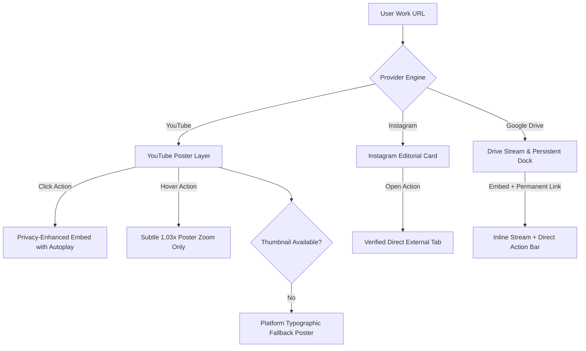

# Reelify — Design System & UI/UX Specification (V1.0 Locked)

**Document Type:** Design System, Art Direction & UX Architecture Specification  
**Version:** V1.0 (Locked Baseline)  
**Status:** Approved for Implementation  
**Product Name (Placeholder):** Reelify  
**Target Audience:** Video Editors, Motion Designers, Visual Storytellers  

---

## 1. Executive Design Philosophy & Architectural Dualism

Reelify operates under a strict **design dualism**:

```text
┌────────────────────────────────────────────────────────────────────────┐
│                          REELIFY ECOSYSTEM                             │
├──────────────────────────────────┬─────────────────────────────────────┤
│      CREATOR PRODUCT UI          │        PUBLIC PORTFOLIO UI          │
│  (Auth, Onboarding, Dashboard,   │       (/[username], /work/[slug])    │
│   Editors, Settings, Admin)      │                                     │
├──────────────────────────────────┼─────────────────────────────────────┤
│ • Utility-first & distraction-free│ • High-end creative studio quality  │
│ • Predictable 4px/8px rhythm     │ • Asymmetric editorial rhythm       │
│ • Low cognitive overhead         │ • Cinematic, media-first pacing     │
│ • Standard accessible controls   │ • Subtle progressive custom cursor  │
│ • Neutral dark-slate surfaces    │ • Deep OLED blacks & sharp contrast │
│ • Fast, dense data manipulation  │ • Dramatic, oversized typography    │
└──────────────────────────────────┴─────────────────────────────────────┘
```

> **The Public Portfolio Rule:** The public portfolio must never look like a dashboard, a template marketplace, a generic card grid, or a standard component library output. It must feel like an independent, custom-built showcase created for a world-class creative studio.

> **The Cinema Philosophy:** The premium feeling does not come from decorative dark effects, glowing borders, or flashy animations. It comes from **typography scale, disciplined whitespace, media scale, asymmetric composition, rhythmic pacing, and restrained motion**.

---

## 2. Design System Foundation & Global Tokens

### 2.1 Color Tokens & Palette

The visual foundation is monochromatic with deliberate, high-contrast values. SaaS gradients and colorful decorative backgrounds are strictly prohibited.

#### A. Global Semantic Scale (CSS Variables)

```css
:root {
  /* Surfaces */
  --bg-canvas: #050505;          /* Absolute deepest background */
  --bg-surface-1: #0A0A0A;        /* Primary container / card surface */
  --bg-surface-2: #121212;        /* Elevated elements, dropdowns, dialogs */
  --bg-surface-3: #1A1A1A;        /* Hover states, active chips */
  --bg-surface-hover: #222222;

  /* Translucent Overlays (Restrained, No Glassmorphism) */
  --overlay-subtle: rgba(10, 10, 10, 0.75);
  --scrim-media: linear-gradient(to top, rgba(0, 0, 0, 0.90) 0%, rgba(0, 0, 0, 0.30) 60%, transparent 100%);

  /* Borders & Dividers */
  --border-subtle: rgba(255, 255, 255, 0.07);
  --border-strong: rgba(255, 255, 255, 0.16);
  --border-focus: rgba(255, 255, 255, 0.40);

  /* Typography / Foreground */
  --text-primary: #FFFFFF;        /* 100% white for headings, primary actions */
  --text-secondary: #A1A1AA;      /* Neutral zinc-400 for descriptions, body */
  --text-muted: #71717A;          /* Zinc-500 for metadata, timestamps, counters */
  --text-dim: #3F3F46;            /* Zinc-700 for disabled states, watermarks */

  /* Accents (Controlled & Theme-Scoped) */
  --accent-cinema: #E5E5E5;       /* Monochrome purity for Cinema */
  --accent-editorial: #FF3B30;    /* Swiss editorial vermillion indicator */
  --accent-studio: #2997FF;       /* Studio electric cyan (subtle metadata only) */
  --accent-active: var(--accent-cinema);

  /* Status Indicators */
  --status-live: #22C55E;         /* Published green */
  --status-draft: #EAB308;        /* Draft warning yellow */
  --status-danger: #EF4444;       /* Destructive red */
}
```

---

### 2.2 Typography System & Exact Locked Fonts

To ensure absolute visual consistency across implementations, exact fonts are locked:

* **Display / Headline Font:** **Syne** (confident, architectural grotesque with tight tracking).
* **Body / Interface Font:** **Plus Jakarta Sans** (clean, geometric, highly legible at small sizes).
* **Technical & Metadata Font:** **Geist Mono** (crisp tabular monospace for indexes `01`, `02`, metadata, and tags).

```css
/* Responsive Typography Scale */
--font-display-hero: clamp(3.25rem, 8.5vw, 9.0rem);    /* Leading: 0.92, Tracking: -0.04em */
--font-display-1: clamp(2.5rem, 5.5vw, 5.0rem);        /* Leading: 0.95, Tracking: -0.035em */
--font-display-2: clamp(2.0rem, 4.0vw, 3.5rem);        /* Leading: 1.05, Tracking: -0.03em */
--font-title-lg: clamp(1.5rem, 2.5vw, 2.25rem);        /* Leading: 1.15, Tracking: -0.02em */
--font-title-md: clamp(1.25rem, 1.8vw, 1.5rem);         /* Leading: 1.25, Tracking: -0.015em */
--font-body-lg: 1.125rem;                               /* Leading: 1.60, Tracking: -0.01em */
--font-body-md: 1.0rem;                                 /* Leading: 1.55, Tracking: 0em */
--font-body-sm: 0.875rem;                               /* Leading: 1.50, Tracking: 0.01em */
--font-mono-num: clamp(1.25rem, 3.0vw, 2.75rem);       /* Tabular, Tracking: -0.02em */
--font-metadata: 0.75rem;                               /* Uppercase, Tracking: 0.12em */
--font-label: 0.6875rem;                                /* Uppercase, Tracking: 0.18em */
```

---

### 2.3 Spacing, Layout & Grid Scales

```css
/* Spacing Scale */
--space-1: 0.25rem;   /* 4px */
--space-2: 0.5rem;    /* 8px */
--space-3: 0.75rem;   /* 12px */
--space-4: 1.0rem;    /* 16px */
--space-6: 1.5rem;    /* 24px */
--space-8: 2.0rem;    /* 32px */
--space-12: 3.0rem;   /* 48px */
--space-16: 4.0rem;   /* 64px */
--space-24: 6.0rem;   /* 96px */
--space-32: 8.0rem;   /* 128px */
--space-48: 12.0rem;  /* 192px */

/* Container Widths */
--container-max-cinema: 1800px;
--container-max-editorial: 1440px;
--container-max-dashboard: 1280px;
--container-max-prose: 720px;

/* Grid Gutters */
--grid-gutter-desktop: 2.5rem;
--grid-gutter-tablet: 1.5rem;
--grid-gutter-mobile: 1.0rem;
```

---

### 2.4 Motion Tokens & Easing Curves

```css
/* Easing Tokens */
--ease-out-editorial: cubic-bezier(0.16, 1, 0.3, 1);    /* Smooth quintic exit */
--ease-in-out-smooth: cubic-bezier(0.65, 0, 0.35, 1);   /* Page transitions */
--ease-spring-snappy: cubic-bezier(0.2, 0.8, 0.2, 1);   /* Button presses */

/* Duration Tokens */
--duration-fast: 150ms;      /* Tooltips, button states */
--duration-standard: 300ms;  /* Dropdowns, modals, card hovers */
--duration-expressive: 650ms;/* Section entries, mask reveals */
--duration-cinematic: 1100ms;/* Hero curtain reveal, media zooms */
```

---

## 3. Media Provider Presentation Architecture

Reelify hosts zero video files. All media is linked from YouTube, Instagram, or Google Drive and presented with broadcast-grade restraint.



### 3.1 YouTube Player Presentation
* **Aspect Ratios:** 16:9 for landscape commercials/showreels; 9:16 for YouTube Shorts.
* **Initial State:** High-resolution video poster overlay (`https://img.youtube.com/vi/{id}/maxresdefault.jpg` with fallback to `hqdefault.jpg`). The raw iframe is **never loaded on initial page load**.
* **Hover Interaction (Desktop):** Subtle 1.03x scale zoom on poster image over 600ms `--ease-out-editorial`. A centered minimal "PLAY" badge reveals. **Video playback does NOT trigger on hover.**
* **Click Action:** Progressively swaps the poster image with a responsive iframe:
  `https://www.youtube-nocookie.com/embed/{id}?autoplay=1&rel=0&modestbranding=1&playsinline=1`.

### 3.2 Instagram Editorial Media Card
* **Philosophy:** No scraping, no brittle API tokens, no cookie walls.
* **Presentation:** Formatted in 4:5 or 9:16 vertical ratio.
* **Visual Structure:**
  * Backdrop: High-contrast monochrome gradient or validated custom thumbnail.
  * Overlay: Scrim gradient (`var(--scrim-media)`).
  * Header: Monospace tag `[INSTAGRAM REEL]` or `[INSTAGRAM POST]`.
  * Lower Third: Project title, category, year.
  * Center Action: Minimal circular badge with Instagram icon and label: `"WATCH REEL ↗"`.
  * Click Action: Opens the verified Instagram URL directly in a new tab.

### 3.3 Google Drive Stream & Persistent Fallback Dock
* **Resilient Architecture:** Preview iframe accompanied by a **permanent direct action bar**.
* **Player Container:** Hosts `https://drive.google.com/file/d/{id}/preview`.
* **Permanent Action Bar:** Always visible at the bottom of the container:
  `[ GOOGLE DRIVE STREAM ] ────────────────────── [ OPEN IN GOOGLE DRIVE ↗ ]`
* If third-party cookie restrictions or permission prompts block the iframe, the visitor is never trapped with a blank box; the persistent direct link immediately connects them to the work.

### 3.4 Platform-Generated Typographic Poster (Deterministic Fallback)
If no thumbnail is available, Reelify dynamically composes a high-contrast typographic poster:
* Background: Deep charcoal tone (`#0D0D0D`).
* Hairline border with corner crosshairs (`+`).
* Top: Monospace project counter (e.g. `02 // SELECTED WORK`).
* Center: Display title set in **Syne** with overflow clipping.
* Bottom: Category (e.g. `COLOR GRADING`), Client (e.g. `NIKE`), Tools (e.g. `DAVINCI RESOLVE`), Year (e.g. `2026`).

---

## 4. Cursor & Interaction Philosophy

The custom cursor is strictly a **progressive enhancement**.

* **Interaction Rule:** The custom cursor must **never** communicate information that does not already exist as readable, accessible UI text. It must never become necessary to understand or trigger an action.
* **Default:** 8px solid white circle tracking the pointer.
* **On Project Link:** Expands to a 64px circular badge showing `"VIEW"`. The underlying project link independently contains full semantic text and accessible ARIA attributes.
* **On Playable Media:** Expands to a 72px pill showing `"PLAY ▶"`.
* **Safety Boundaries:**
  * Disappears automatically when hovering outside the viewport or over native browser UI.
  * Disables pointer-events (`pointer-events: none`) so it never traps or blocks clicks.
  * Completely disabled on touch devices (`pointer: coarse`).
  * Completely disabled when `prefers-reduced-motion: reduce` is detected.

---

## 5. Marketing & Acquisition Experience (`/`)

The landing page communicates the value proposition immediately through real visual demonstrations rather than empty software buzzwords.

```text
┌────────────────────────────────────────────────────────────────────────┐
│ [LOGO] Reelify          Work    Themes    Pricing    About    [SIGN IN]│
├────────────────────────────────────────────────────────────────────────┤
│                                                                        │
│                YOUR WORK. YOUR STORY. ONE LINK.                        │
│                                                                        │
│     Turn your YouTube, Instagram, and Drive edits into a premium       │
│               editorial portfolio. No coding required.                 │
│                                                                        │
│         [ CREATE YOUR PORTFOLIO ]      [ EXPLORE CREATORS ↓ ]          │
│                                                                        │
├────────────────────────────────────────────────────────────────────────┤
│  [ HERO DEMO: BESPOKE CINEMATIC PORTFOLIO PREVIEW (POSTER-FIRST) ]     │
├────────────────────────────────────────────────────────────────────────┤
│  THE SCATTERED REALITY VS. THE ONE LINK                                │
│  "Instagram. YouTube. Google Drive. WhatsApp. Your work shouldn't be." │
├────────────────────────────────────────────────────────────────────────┤
│  THE THREE AESTHETICS (Cinema • Editorial • Studio)                    │
├────────────────────────────────────────────────────────────────────────┤
│  HOW IT WORKS (01 Sign In → 02 Paste Links → 03 Style → 04 Publish)    │
├────────────────────────────────────────────────────────────────────────┤
│  PRICING: FREE AT LAUNCH (₹0)                                          │
├────────────────────────────────────────────────────────────────────────┤
│  FAQ ACCORDION & FINAL HIGH-IMPACT CTA DOCK                            │
└────────────────────────────────────────────────────────────────────────┘
```

### 5.1 Landing Page Section Breakdown

| Section # | Section Name | Layout & Key Elements | Typography & Tokens | Motion & Choreography |
|---|---|---|---|---|
| **01** | **Global Navigation** | 80px height, fixed bar with hairline border (`rgba(255,255,255,0.07)`). Minimal logo left, nav links center, `[ Create Portfolio ]` right. | Nav: `0.875rem` uppercase, tracking `0.1em`. Button: solid white on black. | Slides in from top with 300ms fade. Stays sticky with subtle background fill on scroll. |
| **02** | **Hero** | Centered vertical stack. Display headline: `"YOUR WORK. YOUR STORY. ONE LINK."` Subtitle constrained to 580px max-width. Dual CTA group. | Headline: `--font-display-hero`. Subtitle: `--font-body-lg`, `var(--text-secondary)`. | Staggered fade-up reveal on headline (`delay: 100ms`). CTAs fade up at 500ms. |
| **03** | **Hero Portfolio Demonstration** | Full-width 16:9 cinematic mock portfolio stage. Poster-first presentation; clicking play loads a curated showcase video. | Monospace labels: `0.75rem`. Project title: `--font-title-lg`. | Hover triggers subtle poster scale (1.02x). Parallax depth on scroll (`translateY: -3%`). |
| **04** | **The Problem (Scattered Reality)** | Asymmetric comparison. Left: chaotic badge cloud of external links (YouTube URLs, Drive folders, Instagram DMs). Right: single pristine link `reelify.com/mahesh`. | Headline: `--font-display-2`. Comparison text: `--font-body-md`. | Staggered fade of chaotic links followed by high-contrast illumination of the single link. |
| **05** | **Supported Sources** | Three horizontal columns: YouTube, Instagram, Google Drive. Highlights no video uploads, no compression, zero hosting fees. | Column headings: `--font-title-md`. Card body: `--font-body-sm`. | Subtle border highlight on hover (`border-strong`). |
| **06** | **Theme Showcase** | Full-width interactive tab system demonstrating the 3 themes (Cinema, Editorial, Studio) applied to the exact same project dataset. | Theme tab titles: `--font-display-2`. Spec text: `--font-metadata`. | Tab click triggers a clean cross-fade transition re-skinning the mock portfolio. |
| **07** | **Creator Showcase** | Editorial masonry featuring 3 live portfolio previews (Mahesh, Rahul, Anusha) with **high-res posters and screenshots** (zero multi-player video initialization). | Creator names: `--font-title-lg`. Roles: `--font-metadata`. | Smooth poster zoom on hover; click navigates directly into the creator's portfolio. |
| **08** | **How It Works** | 4-step horizontal sequence: 01 Sign In → 02 Add Work Links → 03 Choose Aesthetic → 04 Publish URL. | Numbers: `--font-mono-num` (`var(--text-muted)`). Steps: `--font-title-md`. | Sequential line reveal connecting the step numbers as the user scrolls into view. |
| **09** | **Pricing (Free at Launch)** | Clean single card: `₹0 / Free at Launch`. "Everything you need to publish your first world-class portfolio." Transparent, zero fake tiers. | Price: `--font-display-1`. Features list: `--font-body-sm`. | High-contrast white border. Zero clutter. |
| **10** | **FAQ Accordion** | 6 essential questions (hosting, links, custom URLs, pricing, video uploads, design updates). | Question: `--font-title-md`. Answer: `--font-body-md` (`var(--text-secondary)`). | Accordion expand: height animate `0` to `auto` with `--ease-out-editorial` (300ms). |
| **11** | **Final Call to Action** | Massive display banner: `"YOUR NEXT CLIENT SHOULD SEE YOUR BEST WORK."` Primary button: `[ CREATE YOUR PORTFOLIO ]`. | Headline: `--font-display-1`. | Ambient background illumination fade. Smooth button hover feedback. |
| **12** | **Footer** | 4-column minimal directory: Product, Explore, Legal, Social. Copyright and platform status indicator (`● All systems operational`). | Links: `0.875rem` (`var(--text-muted)` with hover to white). | Static, zero distraction. |

---

## 6. Authentication & Onboarding Architecture

```text
┌────────────────────────────────────────────────────────────────────────┐
│                        ONBOARDING WIZARD                               │
├────────────────────────────────────────────────────────────────────────┤
│  STEP 1: CLAIM URL       ──►  reelify.com/[ mahesh-editor ]            │
│  STEP 2: IDENTITY        ──►  Display Name, Headline, Bio, Location    │
│  STEP 3: FIRST WORK      ──►  Paste YouTube / Instagram / Drive link   │
│  STEP 4: AESTHETIC       ──►  [ CINEMA ]  [ Editorial ]  [ Studio ]    │
│  STEP 5: PUBLISH CELEBRATION ──► [ VIEW LIVE PORTFOLIO ↗ ]             │
└────────────────────────────────────────────────────────────────────────┘
```

### 6.1 Authentication (`/signin`)
* Single centered card on pure `#050505` canvas.
* Logo at top, followed by headline: `"Sign in to Reelify"`.
* Subtitle: `"Create your video editing portfolio in minutes."`
* Single action: `[ Continue with Google ]` button (white background, black text, official Google SVG glyph).
* Security notice below: `"No password needed. We only request basic profile access."`

### 6.2 5-Step Guided Onboarding (`/onboarding`)
* **Header:** Progress bar with 5 segments indicating active step. A `"Save & Exit to Dashboard"` escape hatch is always visible.
* **Step 1: Claim Username**
  * Input with fixed prefix: `reelify.com/` followed by an auto-focusing input box.
  * Live status pill:
    * `Checking...` (Zinc spinner)
    * `✓ Available` (Subtle green checkmark)
    * `✗ Unavailable` (Subtle red alert with suggestions)
    * `⚠ Reserved route` (Warning explaining system routes)
* **Step 2: Basic Identity**
  * Display name (pre-filled from Google account).
  * Headline: Input placeholder `"Commercial & Music Video Editor"`.
  * Location: Input placeholder `"Mumbai, India"` or `"New York, NY"`.
  * Bio (optional): Textarea with 160-character counter.
  * Profile Photo: Pre-loaded from Google avatar.
* **Step 3: Add First Project**
  * Large URL input: `"Paste a link to your best work (YouTube, Instagram, Google Drive)"`.
  * Instant automatic provider badge display on paste (`[✓ YouTube Detected]`).
  * Progressive reveal of: Project Title, Category (e.g. *Commercial, Narrative, Color Grade, Showreel*), Client, Year, Tools.
* **Step 4: Choose Aesthetic**
  * 3 high-fidelity preview cards: **Cinema (Default)**, **Editorial**, **Studio**.
  * Large visual preview displaying how their Step 3 project looks inside that theme.
* **Step 5: Publish & Live Verification**
  * Live viewport preview of the generated portfolio with two persistent bottom buttons:
    * `[ Edit Changes ]` (returns to steps)
    * `[ Publish Portfolio Now 🚀 ]`
  * On publish: Instant reveal modal displaying: `"Your portfolio is live at reelify.com/username"` with `[ Copy Link ]` and `[ Open Portfolio ↗ ]`.

---

## 7. Creator Dashboard Architecture (`/dashboard`)

The dashboard is a high-speed command center designed for utility and content management.

```text
┌──────────────────────────────────────────────────────────────────────────┐
│ [LOGO] Reelify  Overview  Work  Profile  Design  Preview  Settings  [↗]  │
├──────────────────────────────────────────────────────────────────────────┤
│                                                                          │
│  PORTFOLIO STATUS: ● LIVE                PUBLIC URL: reelify.com/mahesh  │
│                                                                          │
│  ┌──────────────────┐  ┌──────────────────┐  ┌────────────────────────┐  │
│  │  TOTAL PROJECTS  │  │  ACTIVE THEME    │  │  QUICK ACTIONS         │  │
│  │        08        │  │     CINEMA       │  │  [+ Add Work]          │  │
│  │                  │  │                  │  │  [Edit Profile]        │  │
│  └──────────────────┘  └──────────────────┘  └────────────────────────┘  │
│                                                                          │
│  SELECTED WORK (REORDER & MANAGE)                                        │
│  ┌────────────────────────────────────────────────────────────────────┐  │
│  │ [THUMB] Nike - Faster Than Light   Commercial   Published  [•••]   │  │
│  │ [THUMB] Red Bull Music Video       Music Video  Published  [•••]   │  │
│  │ [THUMB] Apple Brand Spot (Draft)   Commercial   Draft      [•••]   │  │
│  └────────────────────────────────────────────────────────────────────┘  │
└──────────────────────────────────────────────────────────────────────────┘
```

### 7.1 Dashboard Routes & Specifications

#### 1. Overview (`/dashboard`)
* Top banner displaying live publication status: `"● Live at reelify.com/username"` with one-click `[ Copy Link ]` and `[ View Live ]`.
* Metric tiles: Total Projects, Active Theme, Profile Completeness meter.
* Quick Add bar: Direct input to paste a new work URL immediately.

#### 2. Work Manager (`/dashboard/work`)
* Project table/card switcher with drag-and-drop sort order.
* Each row displays: Thumbnail preview, Project Title, Source icon (`YT`, `IG`, `Drive`), Category tag, Featured Star (`★`), Status badge (`Published` / `Draft`).
* Row actions: Edit (`pencil`), Preview modal, Quick Toggle Publish, Delete with confirmation modal.
* Empty State: Typographic icon + `"No projects added yet. Your best work belongs here."` with primary `[ + Add Work ]` button.

#### 3. Add Work Wizard (`/dashboard/work/new`)
* Step 1: Input link. System auto-detects provider and normalizes URL.
* Step 2: Form fields grouped cleanly:
  * Title & Slug (auto-generated from title).
  * Category (dropdown with custom input support).
  * Client, Year, Tools (e.g. *Premiere Pro, DaVinci Resolve*).
  * Description (editorial narrative textarea).
  * Custom Poster URL (optional external image link with host validation).
  * Toggles: `"Mark as Featured"` and `"Publish immediately"`.

#### 4. Project Editor (`/dashboard/work/[projectId]/edit`)
* Two-column split layout on desktop:
  * Left Column: Form controls and metadata inputs.
  * Right Column: Live media preview frame showing the exact embed or card presentation.
* Header action bar: `[ Delete Project ]` (destructive red ghost), `[ Save Changes ]` (primary white).

#### 5. Profile Editor (`/dashboard/profile`)
* **Identity Section:** Display Name, Professional Headline, Location, Bio textarea, Profile Image URL.
* **Services & Skills:** Tag-based input with instant chips (e.g. *DaVinci Resolve, 4K Color Grading, Sound Design, Offline Editing*).
* **Social Links:** Dedicated inputs for Instagram, YouTube, LinkedIn, X/Twitter, WhatsApp, and Portfolio/External Site.
* **Availability Toggle:** Switch for `"Available for Freelance / Commercial Work"` which displays an animated green status dot on the public portfolio.

#### 6. Design & Aesthetic Control (`/dashboard/design`)
* Theme selector with real-time responsive preview frame.
* Curated options:
  * **Theme Pick:** Cinema (Dark dramatic) | Editorial (Swiss high-contrast) | Studio (Minimal grid).
  * **Motion Intensity:** Full Cinematic | Restrained.
  * **Accent Color:** Monochrome (Default), Vermillion, Electric Blue, Emerald.
  * **Project Layout:** Alternating Asymmetric | Large Vertical Stacks | Editorial Rows.

#### 7. Draft Preview (`/dashboard/preview`)
* **No Iframe Dependency:** Renders the identical `<PortfolioRenderer />` component directly inside a `<PreviewViewport>` container with responsive device toggle controls (Desktop 100%, Tablet 768px, Mobile 375px).
* Persistent top banner: `"DRAFT PREVIEW MODE — Changes here reflect your unpublished edits."` with a prominent `[ Publish Live ]` CTA.

#### 8. Settings (`/dashboard/settings`)
* **Username Section:** Change username form with explicit alert: *"Changing your username will break existing links in your social bios immediately."*
* **Visibility Section:** Unpublish portfolio toggle (temporarily sets portfolio to offline 404 state).
* **Danger Zone:** Delete Account with double confirmation modal typing the username to confirm.

---

## 8. Public Creator Portfolio (`/[username]`) — Theme Specifications

```text
┌────────────────────────────────────────────────────────────────────────┐
│ MAHESH CH                              ● AVAILABLE FOR WORK            │
│ [WORK]   [ABOUT]   [CONTACT]                                           │
├────────────────────────────────────────────────────────────────────────┤
│                                                                        │
│                       M A H E S H   C H                                │
│                                                                        │
│               COMMERCIAL & MUSIC VIDEO EDITOR                          │
│               MUMBAI, INDIA                                            │
│                                                                        │
├────────────────────────────────────────────────────────────────────────┤
│                                                                        │
│  [  F E A T U R E D   S H O W R E E L   2 0 2 6  -  1 6 : 9  ]         │
│  (Click to Play • Poster-First Cinematic Showcase)                     │
│                                                                        │
├────────────────────────────────────────────────────────────────────────┤
│                                                                        │
│  01 // SELECTED WORK                                                   │
│                                                                        │
│  ┌──────────────────────────────────────────────┐                      │
│  │                                              │   NIKE AIR 2026      │
│  │          [ LARGE ASYMMETRIC MEDIA ]          │   Commercial / Color │
│  │          (Poster + Click to Play)            │   [ VIEW PROJECT ↗ ] │
│  └──────────────────────────────────────────────┘                      │
│                                                                        │
│                                ┌────────────────────────────────────┐  │
│  RED BULL RACING               │                                    │  │
│  Fast Cut Documentary          │      [ LARGE ASYMMETRIC MEDIA ]    │  │
│  [ VIEW PROJECT ↗ ]            │                                    │  │
│                                └────────────────────────────────────┘  │
│                                                                        │
├────────────────────────────────────────────────────────────────────────┤
│  ABOUT & EDITORIAL STATEMENT                                           │
│  "Shaping raw footage into rhythmic, emotive visual journeys."         │
│  SKILLS: Premiere Pro • DaVinci • After Effects • Sound Design         │
├────────────────────────────────────────────────────────────────────────┤
│  LET'S CREATE SOMETHING UNFORGETTABLE.                                 │
│  [ EMAIL CREATOR ]      [ INSTAGRAM ↗ ]      [ WHATSAPP ↗ ]            │
└────────────────────────────────────────────────────────────────────────┘
```

### 8.1 Theme 1: Cinema (V1 Primary Baseline)

* **Visual Atmosphere:** Pitch black `#000000` canvas, high-contrast typography in **Syne**, razor-thin dividers (`rgba(255,255,255,0.08)`), letterboxed video containers, and deep spatial padding.
* **Header & Identity:**
  * Fixed, minimalist header with creator name left and status dot right (`● Available for Work`).
  * Links: `WORK`, `ABOUT`, `CONTACT` with subtle underline hover states.
* **Hero Section:**
  * Display title spanning full viewport width (`font-size: clamp(3rem, 10vw, 9rem)`).
  * Sub-bar displaying creator's actual `headline` and `location` (e.g. `COMMERCIAL EDITOR • MUMBAI, INDIA`).
* **Showreel Centerpiece:**
  * Framed 16:9 widescreen container.
  * Poster-first presentation with a central `"PLAY SHOWREEL ▶"` button. Clicking replaces the poster with the responsive YouTube/Drive embed.
* **Asymmetric Work Showcase:**
  * Uses an alternating 60/40 and 40/60 asymmetric layout.
  * Every item features:
    * Monospace project counter: `01`, `02`, `03` (Geist Mono, 40px tall, zinc-500).
    * Large project title set in **Syne**.
    * Category badge, tools used, and release year.
    * Video/media frame with progressive hover expansion.
* **About & Services:**
  * Editorial split layout: Left column features creator bio; right column lists core services (*Commercial Editing, Long-form Narrative, Color Grading, Sound Synthesis*).
* **Footer & Contact Closing:**
  * Massive closing headline: `"LET'S WORK TOGETHER."`
  * Direct contact dock: Email button, WhatsApp instant link, and social channels.
  * Discreet platform watermark: `"Reelify // Creator Portfolio"`.

---

### 8.2 Theme 2: Editorial (Swiss Typography-Led)

* **Visual Atmosphere:** High-contrast monochromatic composition inspired by Swiss modernism. Off-black `#080808` canvas with crisp stark white typography and vermillion (`#FF3B30`) accent markers.
* **Layout Structure:**
  * Multi-column modular grid with hairline horizontal divider rules between every project row.
  * Projects presented as an expansive typographic index. Hovering over a project row reveals a floating media poster that tracks the cursor.
  * Large grotesque headlines paired with dense tabular metadata.
* **Ideal For:** Narrative film editors and documentary cutters who prioritize storytelling, credits, and typography.

---

### 8.3 Theme 3: Studio (Structured Minimalist Grid)

* **Visual Atmosphere:** Architectural, structured, and rational. Near-black `#0C0C0C` canvas, uniform padding, modular 12-column grid, and electric cyan (`#2997FF`) micro-indicators.
* **Layout Structure:**
  * 2-column and 3-column structured media cards with uniform aspect ratios (16:9 for landscape, 9:16 for vertical reels).
  * Clean, compact project metadata positioned immediately below each media frame.
  * Filter bar allowing visitors to filter by category (*Commercial, Social, Music Video, Personal*).
* **Ideal For:** Freelance editors and agency-style creators who produce high-volume commercial and social media video work.

---

### 8.4 Public Project Page (`/[username]/work/[slug]`)

Each project gets an individual presentation page formatted like an editorial case study.

```text
┌────────────────────────────────────────────────────────────────────────┐
│ ← BACK TO ALL WORK                                          SHARE [↗]  │
├────────────────────────────────────────────────────────────────────────┤
│                                                                        │
│  COMMERCIAL // 2026                                                    │
│  NIKE — FASTER THAN LIGHT                                              │
│                                                                        │
│  ┌──────────────────────────────────────────────────────────────────┐  │
│  │                                                                  │  │
│  │         [ EMBEDDED MEDIA PLAYER — YOUTUBE / DRIVE ]              │  │
│  │                                                                  │  │
│  └──────────────────────────────────────────────────────────────────┘  │
│                                                                        │
│  PROJECT OVERVIEW                                CREDITS & TOOLS       │
│  High-octane commercial edit cut for             Client: Nike Running  │
│  Nike's 2026 Olympic campaign. The edit          Category: Commercial  │
│  blends 35mm film transfers with dynamic         Year: 2026            │
│  sound design and match-cuts.                    Tools: Premiere Pro,  │
│                                                         DaVinci Resolve│
│                                                                        │
├────────────────────────────────────────────────────────────────────────┤
│  NEXT PROJECT ──►                                                      │
│  RED BULL RACING: BEHIND THE DRIFT                                     │
└────────────────────────────────────────────────────────────────────────┘
```

* **Navigation Bar:** Fixed top bar with `← Back to Portfolio` and social share options (Copy URL, LinkedIn, WhatsApp).
* **Hero Information:** Project category, release year, client, and project title rendered in **Syne**.
* **Primary Media Stage:** Full-width responsive player container (16:9 landscape or vertical split for 9:16 Instagram/Shorts).
* **Editorial Details Grid:**
  * Left: Project overview narrative (`description`) describing the editing approach and pacing.
  * Right: Metadata sidebar with Client, Category, Year, Tools, and direct link to source platform.
* **Next Project Bridge:** Seamless footer transition displaying the next project in the creator's portfolio. Clicking anywhere in the bottom 250px triggers a smooth transition directly to the next project.

---

## 9. Comprehensive Page-by-Page Specifications (All 21 V1 Routes)

| # | Route | Purpose | Target Audience | Primary Action | Layout Architecture | Empty / Error / Edge State |
|---|---|---|---|---|---|---|
| **01** | `/` | Acquisition & product showcase | Prospective video editors & visitors | `[ Create Portfolio ]` | Sticky Nav → Hero → Demo Showcase → Problem/Solution → Themes → Showcase → How It Works → Pricing → FAQ → CTA → Footer | Fast static generation; poster-first media. |
| **02** | `/signin` | Frictionless authentication | Returning & new creators | `[ Continue with Google ]` | Minimalist centered card on pure black canvas. Zero distractions. | Auth error banner if OAuth callback fails. |
| **03** | `/onboarding` | 5-step guided portfolio creation | First-time authenticated users | `[ Save & Continue ]` | Top 5-bar step indicator + Centered interactive wizard card. | Inline validation: username taken, invalid URL format. |
| **04** | `/dashboard` | Command center & portfolio status | Authenticated creators | `[ View Live Portfolio ↗ ]` | Top status bar + 3 metric tiles + Quick Add bar + Project list overview. | If zero projects, renders welcome guide empty state. |
| **05** | `/dashboard/work` | Complete project portfolio manager | Authenticated creators | `[ + Add Work ]` | Header with sort/filter controls + Drag-and-drop sortable project table. | Empty state: `"No projects added yet. Start with your best edit."` |
| **06** | `/dashboard/work/new` | Add new work link wizard | Authenticated creators | `[ Save & Publish ]` | 2-step form: URL detection first, followed by metadata fields. | Instant feedback if URL host is unsupported. |
| **07** | `/dashboard/work/[id]/edit` | Update project metadata & media | Authenticated creators | `[ Save Changes ]` | Split desktop view: Left fields, right live preview frame. | 404 page if project ID does not belong to user profile. |
| **08** | `/dashboard/profile` | Creator identity & professional info | Authenticated creators | `[ Update Profile ]` | Grouped cards: Identity, Headline, Location, Bio, Services, Skills, Socials. | Validation alert on invalid social media URLs. |
| **09** | `/dashboard/design` | Visual theme & aesthetic controls | Authenticated creators | `[ Apply Theme ]` | Left control dock (Theme, Motion, Accent) + Right live interactive preview. | Instant CSS variable hot-swapping in preview. |
| **10** | `/dashboard/preview` | Full-screen interactive draft check | Authenticated creators | `[ Publish Live Now ]` | Device switcher bar (Desktop/Mobile) + Direct component render in viewport shell. | Persistent yellow banner: `"Draft Preview Mode"`. |
| **11** | `/dashboard/settings` | Account, username & privacy settings | Authenticated creators | `[ Save Settings ]` | Vertical tabbed settings: Username, Visibility, Account deletion. | Modal with severe warning before username change. |
| **12** | `/[username]` | Public showcase & portfolio surface | Clients, recruiters, visitors | `[ Contact Creator ]` | Theme-driven (Cinema default): Hero → Showreel → Asymmetric Work → About → Contact. | If unpublished: 404 header + custom `"Portfolio Not Published"` view. |
| **13** | `/[username]/work/[slug]` | Individual project deep-dive case study | Clients, recruiters, visitors | `[ Play Media / Open ]` | Back bar → Title header → Main media embed → Credits & Description → Next Project. | 404 if project is draft or slug does not exist. |
| **14** | `/explore` | Basic creator directory (Optional V1) | Public visitors & clients | `[ View Portfolio ]` | Search bar + Category chips + Responsive 3-column creator profile cards. | `"No creators found matching this query."` |
| **15** | `/pricing` | Transparent free launch tier | Prospective creators | `[ Start Free ]` | Minimalist centered pricing card highlighting ₹0 launch tier with FAQ. | Static page; zero payment friction. |
| **16** | `/about` | Platform philosophy & manifesto | Public visitors & creators | `[ Create Your Portfolio ]` | Longform editorial typography with visual manifesto statements. | Pure static page with fluid typography. |
| **17** | `/admin` | Operational moderation dashboard | System administrators | `[ Audit Reports ]` | Metric cards (Total Users, Live Portfolios, Open Reports) + Quick filters. | Access blocked with 403 Forbidden for non-admin users. |
| **18** | `/admin/users` | User management & account inspection | System administrators | `[ Inspect User ]` | Paginated user table with role badges, creation dates, and action menus. | Search input with live debounced filtering. |
| **19** | `/admin/profiles` | Public portfolio moderation & takedown | System administrators | `[ Unpublish / Restore ]` | Portfolio grid with direct preview links and quick unpublish toggles. | Confirmation dialog on unpublish action. |
| **20** | `/admin/projects` | Project media inspection | System administrators | `[ Flag / Remove ]` | Content auditing table with source provider links and thumbnail status. | Direct link to original external media for review. |
| **21** | `/admin/reports` | Abuse, spam & copyright queue | System administrators | `[ Resolve / Dismiss ]` | Report ticket queue showing reported profile, reason, IP hash, and details. | `"Queue empty. No pending reports."` |

---

## 10. State Design: Loading, Empty, Error & Edge States

```text
┌────────────────────────────────────────────────────────────────────────┐
│                        EDGE STATE TAXONOMY                             │
├───────────────────────┬───────────────────────┬────────────────────────┤
│     EMPTY STATES      │     ERROR STATES      │    NOT-FOUND STATES    │
├───────────────────────┼───────────────────────┼────────────────────────┤
│ • Graphic icon        │ • Human-readable text │ • 404 status code      │
│ • Clear headline      │ • Root cause explained│ • Friendly explanation │
│ • 1 Primary action    │ • Next step provided  │ • Link back to home    │
│ • Zero dead ends      │ • Zero raw HTTP codes │ • Zero leaked drafts   │
└───────────────────────┴───────────────────────┴────────────────────────┘
```

### 10.1 Loading States
* **Page Navigation:** Minimal top progress bar (1.5px height, pure white, transitions across top edge).
* **Media Player Loading:** Deep charcoal container with a **subtle opacity pulse** (`opacity: 0.6` to `1.0` over 1200ms). Visible SaaS gradient shimmers are strictly avoided.
* **Dashboard Tables:** Skeleton rows matching actual row heights to prevent layout shifts.

### 10.2 Empty States
* **No Projects in Dashboard:**
  * Icon: Monoline video slate glyph.
  * Headline: `"Your work belongs here."`
  * Subtitle: `"Paste your first YouTube, Instagram, or Google Drive link to build your portfolio."`
  * Action: `[ + Add First Project ]`.
* **No Services / Skills:**
  * Subtle card container with quick-add suggestion chips (*"Color Grading"*, *"Commercial Editing"*, *"Motion Graphics"*).

### 10.3 Error States
* **Unsupported URL in Add Work:**
  * Inline red banner below input: `"We currently support links from YouTube, Instagram, and Google Drive. Check your URL format."`
* **Username Taken:**
  * Red border on input with suggestions: `"@mahesh is already taken. Try @mahesh-editor or @mahesh-cuts."`
* **Google Drive Permission / Block:**
  * Non-blocking message in player container: `"Browser security prevented the inline preview. Use the direct link below."` with prominent `[ Open in Google Drive ↗ ]` button.

### 10.4 Public Not-Found (404) & Unpublished Lifecycle
* **Case A: Username Does Not Exist (`/unknown-user`)**
  * Displays clean 404 page: `"Creator Not Found. The portfolio you are looking for does not exist."` with `[ Explore Other Creators ]` and `[ Back to Reelify ]`.
* **Case B: Profile Exists but is Unpublished**
  * Emits HTTP 404 status (for SEO protection).
  * Displays custom view: `"Portfolio Currently Offline. This creator has not published their portfolio yet."`
* **Case C: Draft Project on Published Profile**
  * Strictly returns 404. Draft projects are inaccessible on public URLs under any circumstance.

---

## 11. Responsive Behavior & Device Strategies

Reelify rejects standard "desktop shrink" responsive design in favor of dedicated viewport compositions.

```text
┌─────────────────────────┬─────────────────────────┬─────────────────────────┐
│     DESKTOP (>1024px)   │     TABLET (768-1024px) │     MOBILE (<768px)     │
├─────────────────────────┼─────────────────────────┼─────────────────────────┤
│ • Full asymmetric split │ • 2-column balanced grid│ • Single fluid column   │
│ • Custom fluid cursor   │ • Native touch cursor   │ • Native touch tap      │
│ • Poster zoom on hover  │ • Static video posters  │ • Tap-to-play embed     │
│ • Persistent nav links  │ • Collapsed nav drawer  │ • Fullscreen sheet menu │
│ • Multi-column metadata │ • Grouped metadata rows │ • Stacked vertical chips│
└─────────────────────────┴─────────────────────────┴─────────────────────────┘
```

### 11.1 Mobile-Specific Adaptations
* **Hero Display Typography:** Scaled via `clamp(2.75rem, 11vw, 4.5rem)` with strict line-height `0.95` to prevent awkward word wrapping on narrow screens.
* **Touch Targets:** All clickable links, buttons, and row items strictly maintain a minimum tap target of `48px × 48px`.
* **Navigation:** Collapses into a fullscreen slide-over drawer triggered by a minimal two-line hamburger icon. Drawer includes large typography links and social icons at the bottom.
* **Media Viewing:** Tapping an Instagram or Drive project on mobile opens the native app deep-link directly where available.

---

## 12. Accessibility & Performance Target Engineering

* **Contrast Standards:** Every text-to-background pairing strictly satisfies **WCAG 2.1 AA** (minimum 4.5:1 for body copy, 3:1 for large display titles).
* **Keyboard Navigation:** Full visible keyboard focus ring (`2px solid rgba(255,255,255,0.7)`) on all interactive buttons, inputs, and links when navigating via `Tab`.
* **Semantic HTML:** Strict document hierarchy: single `<h1>` per page, sequential `<h2>` and `<h3>` tags, semantic `<main>`, `<nav>`, `<article>`, `<header>`, and `<footer>` regions.
* **Reduced Motion Guarantee:** When `prefers-reduced-motion: reduce` is active:
  * All durations drop to `0.01ms` or gentle opacity fades.
  * Continuous ambient animations are paused.
  * Custom cursor is disabled.
* **Performance Strategy & Targets:**
  * **Shell-First Architecture:** Performance is measured on the poster-first page shell before third-party media activation.
  * **Avoidable Layout Shift Elimination:** All media containers declare explicit CSS aspect ratios (`aspect-video`, `aspect-[9/16]`, `aspect-[4/5]`).
  * **Lazy Media:** YouTube iframes and Drive previews load strictly on user click/interaction, keeping initial JavaScript execution minimal.

---

## 13. Component Inventory & Architecture Mapping

```text
src/components/
├── ui/                             # Base primitives (shadcn-compatible, dark custom)
│   ├── button.tsx                  # Variants: primary, secondary, ghost, destructive
│   ├── input.tsx                   # Text, URL, search with debounced callbacks
│   ├── textarea.tsx                # Auto-resizing markdown editor
│   ├── dialog.tsx                  # Radix-backed accessible modal
│   ├── dropdown-menu.tsx           # Radix-backed action menus
│   ├── switch.tsx                  # Binary toggle switches
│   └── tooltip.tsx                 # Accessible micro-labels
│
├── marketing/                      # Landing page modules
│   ├── nav.tsx                     # Fixed navigation bar
│   ├── hero.tsx                    # Display typography & dual CTA
│   ├── interactive-demo.tsx        # Live portfolio switcher preview (poster-first)
│   ├── problem-solution.tsx        # Scattered vs One Link visual comparison
│   ├── theme-showcase.tsx          # Cinema vs Editorial vs Studio interactive demo
│   ├── creator-showcase.tsx        # Live creator cards (poster-first)
│   ├── pricing-card.tsx            # Launch free tier presentation
│   └── faq-accordion.tsx           # Accordion question engine
│
├── dashboard/                      # Creator CMS modules
│   ├── dashboard-header.tsx        # User menu & quick publish status
│   ├── project-table.tsx           # Sortable project manager table
│   ├── project-card.tsx            # Visual card view alternative
│   ├── project-form.tsx            # Multi-step link & metadata creator
│   ├── profile-form.tsx            # Identity, location, services, skills, socials
│   ├── theme-selector.tsx          # Real-time theme customizer
│   └── delete-modal.tsx            # Account & project deletion safeguards
│
└── portfolio/                      # Public Portfolio Engine (First-Class Domain)
    ├── renderer/
    │   ├── portfolio-renderer.tsx  # Dynamic theme dispatcher
    │   └── project-renderer.tsx    # Single project page dispatcher
    ├── shared/
    │   ├── cursor.tsx              # Progressive enhancement desktop cursor
    │   ├── media-stage.tsx         # Unified YouTube / Instagram / Drive player
    │   ├── typographic-poster.tsx  # Deterministic dynamic fallback poster
    │   ├── contact-dock.tsx        # Email, WhatsApp, social action bar
    │   └── project-nav.tsx         # Next / Previous project transition bar
    └── themes/
        ├── cinema/                 # Primary V0/V1 Theme
        │   ├── hero.tsx
        │   ├── showreel.tsx
        │   ├── work-showcase.tsx
        │   └── about.tsx
        ├── editorial/              # Swiss High-Contrast Theme
        └── studio/                 # Structured Minimalist Grid Theme
```

---

## 14. Final Launch Quality Checklist

Before any public portfolio or marketing page is shipped to production, it must clear the following visual and functional gates:

- [ ] **Visual Distinction:** Does the portfolio look like an Awwwards-worthy creative studio rather than a generic SaaS profile?
- [ ] **Disciplined Whitespace:** Is there sufficient negative space (minimum 96px vertical gutters on desktop) allowing the video work to breathe?
- [ ] **Typography Scale:** Are display titles set in **Syne** with negative letter tracking (`-0.03em`)?
- [ ] **Zero Video Hosting Leak:** Are all video assets streamed strictly from verified external providers (YouTube, Instagram, Drive)?
- [ ] **Poster-First Media:** Are all media stages initialized with lightweight posters before activating heavy third-party iframes?
- [ ] **Google Drive Fallback:** Is the "Open in Google Drive" action permanently visible and functional on drive embeds?
- [ ] **Draft Isolation:** Are draft projects completely inaccessible on public routes?
- [ ] **Mobile Touch Polish:** Are all tap targets `>= 48px` with zero horizontal overflow on small viewports?
- [ ] **Accessibility Compliance:** Are focus rings visible on Tab navigation and all color contrasts `>= 4.5:1`?
- [ ] **Creator Confidence Test:** Would a top-tier commercial video editor proudly paste `reelify.com/username` into their Instagram bio or agency proposal?

---

*This specification is LOCKED as the definitive UI/UX implementation guide for Reelify V1.0.*
