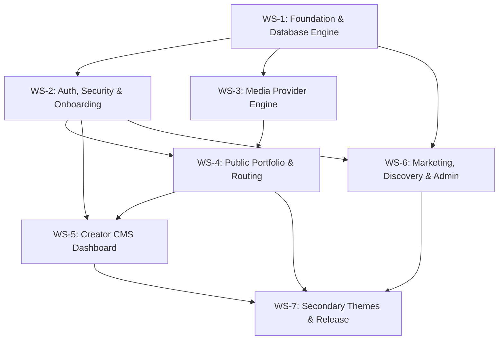

# Reelify — V1 Streamlined Execution Plan

**Document Type:** V1 Implementation Task Specification  
**Version:** V1.1 (Streamlined)  
**Status:** Locked & Approved  
**Product Name (Placeholder):** Reelify  

---

## 1. Architectural Authority & Governance

This document establishes the streamlined, dependency-sequenced engineering task contract for Reelify V1. Tasks are scoped as cohesive, capability-driven implementation units (~21 tasks across 7 workstreams) rather than micro-file tickets, optimizing for high-velocity agent execution without sacrificing architectural rigor.

### 1.1 Precedence Hierarchy
All task implementations **MUST** strictly adhere to the five locked specification documents in order of precedence:
1. `rules.md` (V1 Behavioral, Security & Application Rules — Locked)
2. `database.md` (Database Architecture & Schema Specification — Locked)
3. `architecture.md` (System Architecture Specification — Locked)
4. `design.md` (Design System & UI/UX Specification — Locked)
5. `prd.md` (Product Requirements Document — Baseline)

Any instruction, outdated planning snippet, or developer assumption conflicting with these locked documents is invalid.

### 1.2 Universal Definition of Done (DoD)
A task is marked **`DONE`** if and only if:
1. Code implementation is complete, typed, and idiomatic.
2. All TypeScript compilation (`tsc --noEmit`) and ESLint checks pass with zero errors.
3. Automated unit, integration, or visual tests associated with the task pass.
4. All Acceptance Criteria checkboxes in the task specification are satisfied.
5. No higher-priority rule or locked architectural invariant is violated.
6. Zero synthetic/fake data is committed to production migrations or runtime schemas.
7. Zero out-of-scope post-V1 features (billing, analytics, custom domains, video hosting) are introduced.

### 1.3 Blocked Protocol
If an engineer or agent encounters an unexpected obstacle or third-party limitation:
1. The task status **MUST** immediately be set to **`BLOCKED`**.
2. The exact technical conflict **MUST** be documented in the task notes.
3. The engineer **MUST NOT** silently redesign the architecture or alter locked contracts.
4. The smallest explicit proposal to unblock the task **MUST** be surfaced for review.

---

## 2. High-Level Dependency Graph



---

## 3. The Lightweight Verification Harness

The harness enforces architectural boundaries and guarantees quality through small, automated checks rather than administrative bureaucracy.

### 3.1 Verification Commands
Every implementation unit is verified using core terminal commands:
```bash
npm run typecheck    # tsc --noEmit
npm run test         # vitest run unit tests
npm run check        # typecheck + test + lint
npm run verify       # Comprehensive (once release scripts exist): check + firewall & purity scan
```

### 3.2 Permanent Invariants for Coding Agents
1. **Read locked docs before implementation:** Always align with `rules.md`, `database.md`, and `architecture.md`.
2. **Never modify locked specifications:** Specifications define *what* the product is.
3. **Implement only the assigned task/workstream:** Avoid unbounded refactoring of unrelated files.
4. **Never introduce V2 features:** Zero billing (Razorpay/Stripe), custom domains, video binary uploads, Redis, or Vimeo.
5. **Never use fake production data:** Zero demo users ("Mahesh", "Rahul") or brands ("Nike", "Apple") in production schemas.
6. **Strict ownership enforcement:** Always verify `resource -> profile -> profile.userId === session.user.id`.
7. **Strict public data sanitization:** Never expose database UUIDs, user IDs, emails, or session info on public routes.
8. **Poster-first media loading:** Never mount YouTube/Drive iframes or autoplay video on initial page shell load.
9. **Published slug immutability:** Once `published_at IS NOT NULL`, project slugs can never change.
10. **On architectural conflict:** Mark task `BLOCKED` immediately.

---

## 4. Execution Plan (21 Cohesive Tasks)

### Workstream 1: Foundation & Database Engine

#### TASK-01 — Foundation, Tokens, Environment & Test Harness
Status: DONE  
Dependencies: None  
Goal: Initialize the repository foundation, install approved dependencies, configure design tokens, typed environment validation, domain error handling, and automated test runners.  
Scope:
- Scaffold clean directory structure: `src/{app,components,features,db,lib}` according to `architecture.md`.
- Install approved production dependencies: `@neondatabase/serverless`, `drizzle-orm`, `better-auth`, `@better-auth/drizzle-adapter`, `@radix-ui/react-dialog`, `zod`, `motion`, `slugify`, `clsx`, `tailwind-merge`.
- Install approved dev dependencies: `drizzle-kit`, `@next/bundle-analyzer`, `vitest`, `@testing-library/react`, `@testing-library/jest-dom`, `playwright`, `@axe-core/playwright`, `@types/*`.
- Configure fonts via `next/font`: **Syne** (Display), **Plus Jakarta Sans** (Body), **Geist Mono** (Technical/Metadata).
- Configure `globals.css` with surfaces (`#000000`, `#0A0A0A`, `#121212`), hairline borders, and typography fluid clamps.
- Implement typed `src/env.ts` validating `DATABASE_URL`, `BETTER_AUTH_SECRET`, `BETTER_AUTH_URL`, `GOOGLE_CLIENT_ID`, `GOOGLE_CLIENT_SECRET`, `NEXT_PUBLIC_APP_URL`, `REPORT_PEPPER_SECRET`.
- Implement lightweight domain error class `AppError` (`code`, `message`, `statusCode`) and Server Action response wrapper `ActionResponse<T>`.
- Configure `vitest.config.mts` and baseline smoke test `tests/unit/smoke.test.ts`.  
Acceptance Criteria:
- [x] Workspace builds cleanly with `npm run build`.
- [x] `src/env.ts` halts startup with clear error if required secrets are missing.
- [x] `npm run test` executes Vitest and passes baseline harness assertions.  
Files: `src/env.ts`, `src/lib/errors.ts`, `src/lib/types.ts`, `src/app/globals.css`, `src/app/layout.tsx`, `vitest.config.mts`, `tests/unit/smoke.test.ts`

---

#### TASK-02 — Database Engine, Schemas, Triggers & Migrations
Status: DONE  
Dependencies: TASK-01  
Goal: Declare all Drizzle ORM schemas, PostgreSQL enums, database triggers, performance indexes, and generate clean SQL migrations.  
Scope:
- Initialize Neon serverless pool and Drizzle client in `src/db/index.ts`.
- Declare all 7 native PostgreSQL enums (`user_role`, `media_source_type`, `social_platform`, `portfolio_theme`, `motion_level`, `report_reason`, `report_status`).
- Define core Better Auth tables (`user` with UUID & role, `session`, `account` with token expiration columns, `verification`).
- Define application tables:
  - `profiles`: `id` (UUID), `user_id` (FK unique cascade), `username` (unique lowercase), `display_name`, `headline`, `location`, `bio`, `avatar_url`, `is_available`, `is_published`.
  - `projects`: `id`, `profile_id` (FK cascade), `title`, `slug`, `description`, `source_type`, `source_url`, `thumbnail_url`, `category`, `client`, `year` (smallint), `tools` (text[]), `featured`, `sort_order`, `is_published`, `published_at` (timestamptz nullable).
  - `social_links`, `services`, `skills`, `portfolio_settings`.
  - `reports`: `id`, `profile_id`, `project_id`, `reporter_ip_hash`, `reason`, `description`, `status`, `resolved_at`, `resolved_by`.
- Implement raw SQL migration for triggers (`drizzle/0001_triggers.sql`):
  - `trg_projects_update_fn`: Enforces published slug immutability (`IF OLD.published_at IS NOT NULL AND NEW.slug <> OLD.slug THEN RAISE EXCEPTION`).
  - `trg_projects_pre_delete_fn`: Automatically sets `reports.project_id = NULL` prior to project deletion.
  - `update_updated_at_column`: Auto-updates timestamps across all tables.
- Implement explicit indexes: `idx_profiles_username_lower`, partial index on published profiles, partial composite `idx_projects_public_fetch`, `idx_reports_throttling`, `idx_reports_pending_queue`.
- Add development fixture guard `assertDevelopmentEnvironment()` in `src/db/fixtures/guard.ts`.
- Generate and verify initial SQL migrations using `drizzle-kit`.  
Acceptance Criteria:
- [x] Fresh database migration runs cleanly without errors.
- [x] Published slug immutability trigger blocks SQL slug updates when `published_at IS NOT NULL`.
- [x] Project deletion decouples linked reports cleanly.  
Files: `src/db/schema/*`, `drizzle/*`, `src/db/index.ts`, `src/db/fixtures/guard.ts`

---

### Workstream 2: Auth, Security & Onboarding

#### TASK-03 — Better Auth Integration & Security Guards
Status: DONE  
Dependencies: TASK-02  
Goal: Configure Better Auth server instance, Google OAuth, session resolvers, and server-side authorization guards.  
Scope:
- Configure Better Auth server in `src/lib/auth.ts`: `@better-auth/drizzle-adapter`, `advanced.database.generateId: false` (PostgreSQL native UUIDs), encrypted OAuth tokens, Google provider, client role input disabled.
- Mount API handler at `src/app/api/auth/[...all]/route.ts` and initialize client in `src/lib/auth-client.ts`.
- Implement session and role guards in `src/lib/auth-guards.ts`:
  - `getCurrentUser()`: Resolves session safely from request headers.
  - `requireAuth()`: Asserts session exists or throws `AppError.unauthorized()`.
  - `requireAdmin()`: Asserts `user.role === 'admin'` or throws `AppError.forbidden()`.
  - `requireProfileOwner(profileId)`: Queries profile and verifies `profile.userId === session.user.id`.
- Implement CSRF / same-origin check for custom Route Handlers in `src/lib/csrf.ts`.
- Implement CLI admin promotion script `src/scripts/seed-admin.ts` (`npm run db:seed-admin`).  
Acceptance Criteria:
- [x] Better Auth ping responds successfully at `/api/auth/ok`.
- [x] `requireAuth()` and `requireProfileOwner()` strictly reject unauthorized requests.
- [x] Admin guard blocks creator sessions and permits admin sessions.  
Files: `src/lib/auth.ts`, `src/lib/auth-guards.ts`, `src/lib/auth-client.ts`, `src/lib/csrf.ts`, `src/scripts/seed-admin.ts`

---

#### TASK-04 — 5-Step Onboarding Engine & First Publication
Status: DONE  
Dependencies: TASK-03  
Goal: Build the 5-step onboarding wizard UI and Server Actions deriving progress directly from existing tables without an extra database table.  
Scope:
- Implement step progress derivation in `src/features/onboarding/progress.ts`:
  - Step 1: No profile -> Claim username.
  - Step 2: Missing `displayName` OR `headline` -> Identity setup.
  - Step 3: Zero projects -> Add first project.
  - Step 4: Settings unconfigured -> Aesthetic selection.
  - Step 5: Unpublished profile -> Preview & publish.
- Implement Server Actions:
  - `claimUsernameAction`: Normalizes lowercase, validates regex, checks reserved names, enforces 30 req/min rate limit, handles unique collision `23505`.
  - `updateIdentityAction`: Validates and saves `displayName` (2-100), `headline` (2-120), `location`, `bio`.
  - `createFirstProjectAction`: Parses media URL, normalizes provider, generates deterministic slug, sets `sort_order: 0`.
  - `setAestheticAction`: Saves theme (`portfolio_theme` enum) and motion level.
  - `publishOnboardingPortfolioAction`: Atomic transaction verifying publish readiness, setting `projects.is_published = true`, `projects.published_at = now()`, `profiles.is_published = true`, revalidates `/${username}`.
- Build onboarding wizard UI at `src/app/(auth)/onboarding/page.tsx` with high-contrast steps and celebration modal displaying `${process.env.NEXT_PUBLIC_APP_URL || ''}/${username}` with copy link action.  
Acceptance Criteria:
- [x] Onboarding wizard places creator dynamically on the correct step based on database state.
- [x] Reserved usernames rejected; valid claims persist profile cleanly.
- [x] Publish gatekeeper verifies all minimum requirements and activates profile atomically.  
Files: `src/app/(auth)/onboarding/*`, `src/features/onboarding/*`

---

### Workstream 3: Media Provider Engine

#### TASK-05 — Media Engine & Provider Resolvers
Status: DONE  
Dependencies: TASK-01  
Goal: Implement the core `MediaProvider` interface, canonical allowlist, and zero-fetch provider normalization logic.  
Scope:
- Define `MediaProvider` interface and `ALLOWED_MEDIA_HOSTS` allowlist in `src/features/media/types.ts`.
- Implement YouTube provider (`src/features/media/providers/youtube.ts`):
  - Supports standard watch, short `youtu.be`, and shorts URLs.
  - Normalizes to canonical `https://www.youtube.com/watch?v={id}`.
  - Derives privacy embed `https://www.youtube-nocookie.com/embed/{id}?autoplay=1&rel=0&modestbranding=1&playsinline=1`.
  - Derives thumbnail `https://img.youtube.com/vi/{id}/maxresdefault.jpg`.
- Implement Instagram provider (`src/features/media/providers/instagram.ts`):
  - Supports reels, posts, and IGTV.
  - Normalizes preserving subtype: `/reel/{id}/`, `/p/{id}/`, `/tv/{id}/` (does NOT convert posts/IGTV to reels).
  - Emits card embed metadata directing to native external link without scraping.
- Implement Google Drive provider (`src/features/media/providers/google-drive.ts`):
  - Supports view and open file URLs; normalizes to `drive.google.com/file/d/{id}/view`.
  - Generates preview embed `drive.google.com/file/d/{id}/preview`.
- Implement primary dispatcher `parseMediaUrl(url)`:
  - Rejects unknown hosts, disallowed protocols (`javascript:`, `data:`), and arbitrary ports.
  - Returns canonical URL, provider type, and embed metadata.  
Acceptance Criteria:
- [x] YouTube, Instagram, and Drive URLs correctly parsed and normalized.
- [x] Disallowed hosts and malformed URLs rejected cleanly with descriptive user error.
- [x] Zero server-side HTTP fetching or third-party scraping dependencies.  
Files: `src/features/media/*`

---

#### TASK-06 — Poster-First Media UI Components
Status: DONE  
Dependencies: TASK-05  
Goal: Build the responsive, poster-first player and card components matching `design.md` Section 3.  
Scope:
- Build `YouTubePlayer` (`src/features/media/components/youtube-player.tsx`):
  - Explicit `aspect-video` container (zero CLS).
  - Initial load renders lightweight poster with fallback; zero iframes initialized.
  - Desktop hover: 1.03x scale poster zoom with magnetic PLAY badge.
  - Click: Progressively mounts `youtube-nocookie.com` iframe with `autoplay=1`.
- Build `InstagramCard` (`src/features/media/components/instagram-card.tsx`):
  - 9:16 vertical ratio container, monospace `[INSTAGRAM REEL]` badge, title, and circular "WATCH REEL ↗" direct action button. Zero iframes.
- Build `DrivePlayer` (`src/features/media/components/drive-player.tsx`):
  - Lazy-loaded preview iframe with `IntersectionObserver`.
  - Permanent bottom dock: `[ GOOGLE DRIVE STREAM ] ────── [ OPEN IN GOOGLE DRIVE ↗ ]` providing seamless access even if cookies block embed.
- Build `TypographicPoster` (`src/features/media/components/typographic-poster.tsx`):
  - Charcoal container, hairline border, index counter, title, category, client, year fallback when no thumbnail exists.  
Acceptance Criteria:
- [x] Zero YouTube/Drive iframes rendered on initial page load.
- [x] User click cleanly mounts video player.
- [x] Drive player fallback dock is permanently accessible.  
Files: `src/features/media/components/*`

---

### Workstream 4: Public Portfolio & Routing

#### TASK-07 — Public Data Layer, Projections & Renderer Dispatcher
Status: DONE  
Dependencies: TASK-02  
Goal: Implement the data layer separating internal `PortfolioData` from sanitized `PublicPortfolioData`, high-performance queries, and the `<PortfolioRenderer />` dispatcher.  
Scope:
- Define contracts in `src/features/portfolio/types.ts`:
  - `PortfolioData`: Internal contract retaining database IDs for dashboard CRUD and draft preview.
  - `PublicPortfolioData`: Sanitized public projection contract strictly stripping all internal UUIDs, user IDs, emails, session info, and draft projects.
- Implement mapper `toPublicPortfolioData(dbProfile)` enforcing public projection purity.
- Implement query `getPublicPortfolio(username)`: single performant join query returning published profile and published projects ordered by `ASC(sort_order), DESC(created_at)`.
- Implement query `getPublicProject(username, slug)`: queries published project under published profile with previous/next project bridges.
- Implement dynamic dispatcher `<PortfolioRenderer portfolio={data} />` in `src/features/portfolio/renderer/portfolio-renderer.tsx`:
  - Dispatches to active theme (initially Cinema, extensible for Editorial/Studio).
  - Gracefully falls back to Cinema on unknown theme keys.  
Acceptance Criteria:
- [x] Public projection mapping strips 100% of internal database UUIDs and sensitive fields.
- [x] Query returns null for draft profiles or draft projects.
- [x] `<PortfolioRenderer />` renders both public projection and draft portfolio cleanly.  
Files: `src/features/portfolio/types.ts`, `src/features/portfolio/mappers.ts`, `src/features/portfolio/queries/*`, `src/features/portfolio/renderer/*`

---

#### TASK-08 — Cinema Theme Implementation (Primary V1 Theme)
Status: DONE  
Dependencies: TASK-06, TASK-07  
Goal: Build the complete Cinema portfolio theme matching `design.md` Section 8.1.  
Scope:
- Implement Cinema theme components in `src/features/portfolio/themes/cinema/*`:
  - `CinemaLayout`: `#000000` canvas, hairline borders, widescreen container (`--container-max-cinema: 1800px`), minimal header with live status dot (`● Available for Work`) and navigation anchors.
  - `CinemaHero`: Oversized Syne display headline (`clamp(3.5rem, 10vw, 9rem)`), negative tracking, real location sub-bar, staggered fade-in.
  - `CinemaShowreel`: Featured edit centerpiece supporting YouTube, Drive, Instagram, and fallback typographic poster with magnetic play badge.
  - `CinemaWork`: Alternating 60/40 and 40/60 asymmetric project showcase with monospace indices, metadata chips, unified media frame, and case-study link.
  - `CinemaAbout`: Editorial bio split with commercial services and technical software chips (*Premiere Pro, DaVinci Resolve, Color Grading*).
  - `CinemaFooter`: Closing display headline, direct WhatsApp link, configured social profile destinations (`social_links`), report trigger, platform watermark. (Zero account email exposure).
  - `CinemaProjectPage`: Case study presentation with back link, responsive media stage, narrative description, metadata sidebar, and next-project bridge.
- Implement progressive custom cursor (`src/features/portfolio/shared/cursor.tsx`) disabled on touch and reduced-motion.  
Acceptance Criteria:
- [x] Cinema theme renders complete portfolio layout matching design specifications.
- [x] Widescreen stage and asymmetric showcase render seamlessly on desktop and mobile.
- [x] Zero email address leakage in public footer dock.  
Files: `src/features/portfolio/themes/cinema/*`, `src/features/portfolio/shared/cursor.tsx`

---

#### TASK-09 — Public Routing, 404 & OpenGraph Metadata
Status: DONE  
Dependencies: TASK-07, TASK-08  
Goal: Wire the public Next.js App Router routes, custom 404 handler, and dynamic SEO metadata.  
Scope:
- Implement `src/app/[username]/page.tsx`:
  - Server Component resolving `getPublicPortfolio(params.username)`.
  - Emits `notFound()` if profile is null or unpublished.
  - Renders `<PortfolioRenderer portfolio={data} />` with ISR revalidation tags.
- Implement `src/app/[username]/work/[slug]/page.tsx`:
  - Server Component resolving `getPublicProject(params.username, params.slug)`.
  - Emits `notFound()` if profile or project is unpublished.
  - Renders project case-study page.
- Implement `src/app/[username]/not-found.tsx`:
  - Displays clean message: *"This work is not available."* with 404 HTTP status header.
- Implement `generateMetadata()` for both routes with dynamic title (`${displayName} — ${headline}`), description, OpenGraph tags, and canonical URLs using `process.env.NEXT_PUBLIC_APP_URL`.  
Acceptance Criteria:
- [x] Public routes render published portfolios and projects cleanly.
- [x] Draft portfolios and unpublished projects return 404 without internal state leakage.
- [x] Social share preview tags correctly generated.  
Files: `src/app/[username]/*`

---

### Workstream 5: Creator CMS Dashboard

#### TASK-10 — Dashboard Shell & Overview
Status: DONE  
Dependencies: TASK-03  
Goal: Build the authenticated dashboard shell, sidebar navigation, and overview summary view matching `design.md` Section 7.  
Scope:
- Implement `src/app/dashboard/layout.tsx`:
  - Enforces `requireAuth()`. Resolves creator profile; redirects to `/onboarding` if unconfigured.
  - Sidebar navigation: `Overview`, `Work`, `Profile`, `Design`, `Preview`, `Settings`.
  - Top bar with live status indicator: `● Live at ${NEXT_PUBLIC_APP_URL}/${username}` and persistent `[ View Live ↗ ]` button.
- Implement `src/app/dashboard/page.tsx` (Overview):
  - Metric tiles: Real project count, active theme name, profile completeness indicator.
  - Quick Add Work bar: Instant link input to paste media URL.
  - Recent project cards with quick edit shortcuts.
  - Strictly zero fake analytics or fabricated view counts.  
Acceptance Criteria:
- [x] Unauthenticated requests redirected to `/signin`.
- [x] Authenticated creators navigate cleanly across dashboard tabs.
- [x] Real operational metrics displayed accurately.  
Files: `src/app/dashboard/layout.tsx`, `src/app/dashboard/page.tsx`, `src/components/dashboard/*`

---

#### TASK-11 — Project Management (Work Table, Wizard, Editor, Reorder, Delete)
Status: DONE  
Dependencies: TASK-05, TASK-10  
Goal: Build complete project lifecycle management including work table, creation wizard, split editor, atomic reordering, and deletion.  
Scope:
- Work manager table (`src/app/dashboard/work/page.tsx`):
  - Displays thumbnail, title, provider badge, category, featured star, publish status badge.
  - Row actions: Edit, Quick Publish Toggle, Delete.
  - Empty state: Video slate icon + *"Your best work belongs here."*
- Creation wizard (`src/app/dashboard/work/new/page.tsx`):
  - Link input with automatic provider detection.
  - Title, category, client, year (SMALLINT), tools list, description.
  - Custom poster URL validated against `ALLOWED_THUMBNAIL_IMAGE_HOSTS` allowlist (Unsplash, Sanity, Google, Imgur, Cloudinary) with HTTPS.
  - Server action `createProjectAction` with `retry-on-23505` slug collision loop.
- Split-screen editor (`src/app/dashboard/work/[projectId]/edit/page.tsx`):
  - Enforces `requireProfileOwner`. Left editing form; right live media stage preview.
  - Server action `updateProjectAction`.
  - Dedicated action `toggleProjectPublishAction`: stamps `published_at = now()` on first publication; unpublishing leaves `published_at` intact.
  - Read-only slug once `published_at IS NOT NULL` (enforced by trigger `trg_projects_update_fn`).
  - Revalidates both `/${username}` and `/${username}/work/${slug}`.
- Reorder action (`src/features/projects/actions/reorder-projects.ts`):
  - `reorderProjectsAction`: acquires `pg_advisory_xact_lock(hashtext(profileId))` for concurrency safety, re-verifies project IDs, and updates sequential `sort_order` in an atomic transaction.
- Deletion action (`src/features/projects/actions/delete-project.ts`):
  - Removes project row; database trigger automatically decouples linked reports.  
Acceptance Criteria:
- [x] Creators can create, edit, toggle publish status, reorder, and delete projects.
- [x] Published slugs remain strictly immutable even after unpublishing.
- [x] Reorder transaction prevents concurrency race conditions.  
Files: `src/app/dashboard/work/*`, `src/features/projects/*`

---

#### TASK-12 — Profile & Credentials Management
Status: DONE  
Dependencies: TASK-10  
Goal: Build the profile, identity, services, and skills management page.  
Scope:
- Implement `src/app/dashboard/profile/page.tsx`:
  - Identity form: Display name (2-100), headline (2-120), location, bio, availability switch (`● Available for Work`).
  - Commercial services CRUD: Title, description, sort order.
  - Technical skills CRUD: Software/skill name chips.
  - Social links CRUD: Platform selection, URL validation (enforcing `https://`).
- Implement Server Action `updateProfileAction` enforcing `requireProfileOwner` and revalidating `/${username}`.  
Acceptance Criteria:
- [x] Creator updates credentials, services, skills, and links cleanly.
- [x] Public portfolio immediately reflects updated profile information.  
Files: `src/app/dashboard/profile/page.tsx`, `src/features/profile/*`

---

#### TASK-13 — Design Switcher, Draft Device Preview & Settings
Status: DONE  
Dependencies: TASK-07, TASK-10  
Goal: Build the aesthetic customization control panel, device draft preview shell, and account settings.  
Scope:
- Design view (`src/app/dashboard/design/page.tsx`):
  - Theme selector (Cinema, plus Editorial/Studio as registered).
  - Motion level toggle (`full`, `reduced`).
  - Accent color picker (`#E5E5E5`, `#FF3B30`, `#2997FF`).
  - Server action `updatePortfolioSettingsAction` revalidating `/${username}`.
- Integrated draft preview (`src/app/dashboard/preview/page.tsx`):
  - Queries internal `PortfolioData` via `getDraftPortfolio(profileId)`.
  - Renders production `<PortfolioRenderer />` directly inside responsive viewport container (Desktop 100%, Tablet 768px, Mobile 375px) with zero iframes.
  - Banner: `"DRAFT PREVIEW MODE — Changes here reflect your unpublished edits."` with `[ Publish Live ]` CTA.
- Settings view (`src/app/dashboard/settings/page.tsx`):
  - Username update action with severe warning dialog, collision handling, and cache invalidation for both old and new URLs.
  - Portfolio visibility toggle (`profiles.is_published`).
  - Danger Zone account deletion cascading all user records.  
Acceptance Criteria:
- [x] Aesthetic controls update database and revalidate portfolio cleanly.
- [x] Draft preview renders unpublished edits accurately across device viewports.
- [x] Username change invalidates both old and new route caches.  
Files: `src/app/dashboard/design/*`, `src/app/dashboard/preview/*`, `src/app/dashboard/settings/*`

---

### Workstream 6: Marketing, Discovery & Moderation

#### TASK-14 — Marketing Landing, Pricing & About Pages
Status: DONE  
Dependencies: TASK-01  
Goal: Build the marketing layout, media-first landing page, pricing page, and manifesto matching `design.md` Section 5.  
Scope:
- Marketing layout (`src/app/(marketing)/layout.tsx`):
  - Fixed 80px navbar with logo, navigation links, auth buttons, mobile menu drawer, and 4-column footer directory.
- Landing page (`src/app/(marketing)/page.tsx`):
  - Hero with oversized Syne typography: `"YOUR WORK. YOUR STORY. ONE LINK."` and dual CTAs.
  - Interactive demo stage (poster-first preview) & scattered links comparison (`${NEXT_PUBLIC_APP_URL}/yourname`).
  - Theme tab switcher & static creator showcase using posters/screenshots only (zero multiple iframes, zero fake DB rows).
  - How it works 4-step sequence, transparent ₹0 launch pricing card, and accessible FAQ accordion.
- Static marketing pages:
  - `/pricing`: Transparent free launch tier showcase with detailed FAQ.
  - `/about`: Creator-first editorial manifesto (*"Creators should spend time making work, not building websites."*).  
Acceptance Criteria:
- [x] High-contrast editorial marketing pages render cleanly.
- [x] Demo stage adheres to poster-first rule without heavy initial iframe loading.
- [x] Zero synthetic creator records committed to database.  
Files: `src/app/(marketing)/*`, `src/components/marketing/*`

---

#### TASK-15 — Public Creator Explore Directory
Status: DONE  
Dependencies: TASK-07, TASK-14  
Goal: Implement the public creator discovery directory route.  
Scope:
- Implement `src/app/explore/page.tsx`:
  - Queries real published profiles (`is_published: true`) with at least one published project.
  - Search input and category filter chips.
  - Responsive 3-column creator cards displaying avatar, display name, headline, location, and featured thumbnail.
  - Clean empty state when zero creators exist: graphic + *"No creators published yet. Be the first to publish your portfolio."* with `[ Create Portfolio ]` CTA.  
Acceptance Criteria:
- [x] Only real published creators appear in directory.
- [x] Empty state renders cleanly on an empty database.  
Files: `src/app/explore/page.tsx`, `src/features/explore/*`

---

#### TASK-16 — Abuse Reporting System
Status: DONE  
Dependencies: TASK-02, TASK-08  
Goal: Implement the accessible public abuse report dialog and atomic rate-limited submission action.  
Scope:
- Build accessible `@radix-ui/react-dialog` modal (`src/features/reports/components/report-modal.tsx`) triggered from portfolio footer (`[ Report Portfolio ]`).
  - Reasons: `spam`, `copyright`, `inappropriate`, `impersonation`, `other`. Description textarea.
- Implement Server Action `submitReportAction({ username, projectSlug?, reason, description })`:
  - Resolves internal `profile.id` and optional `project.id` server-side with publication checks (rejects with 404 if draft or missing).
  - Computes salted HMAC-SHA256 IP hash (`reporter_ip_hash`). Plaintext IP is never stored.
  - Inside a transaction: acquires `pg_advisory_xact_lock(hashtext(reporter_ip_hash))` and checks reports in last hour.
  - If count >= 5, aborts with HTTP 429 `"You have submitted multiple reports recently. Please try again later."`
  - Inserts report with `status: 'pending'`.  
Acceptance Criteria:
- [x] Public reports accepted via safe username/projectSlug payload without exposing internal UUIDs.
- [x] Concurrency-safe rate limit enforced at 5/hour per IP hash.  
Files: `src/features/reports/*`

---

#### TASK-17 — Admin Command Center & Moderation Queues
Status: DONE  
Dependencies: TASK-03, TASK-16  
Goal: Build the administrative command center, user/profile audits, project moderation, and abuse report queue.  
Scope:
- Admin layout & overview (`src/app/admin/layout.tsx`, `src/app/admin/page.tsx`):
  - Enforces `requireAdmin()`.
  - Displays real operational metrics: Registered Users, Live Profiles, Published Projects, Open Pending Reports.
- Users & Profiles view (`src/app/admin/users/page.tsx`, `src/app/admin/profiles/page.tsx`):
  - User and profile tables with `unpublishProfileModerationAction(profileId)` to force `is_published: false`.
- Projects moderation view (`src/app/admin/projects/page.tsx`):
  - Searchable project table with `unpublishProjectModerationAction(projectId)` to unpublish individual violating projects.
- Reports queue (`src/app/admin/reports/page.tsx`):
  - Lists pending reports with direct links to target profile/project.
  - Actions: `resolveReportAction` and `dismissReportAction` updating `resolved_at = now()` and `resolved_by = session.user.id`.  
Acceptance Criteria:
- [x] Admin command center restricted strictly to admin role.
- [x] Admins can inspect entities, unpublish violating portfolios/projects, and resolve reports with audit trails.  
Files: `src/app/admin/*`, `src/features/admin/*`

---

### Workstream 7: Secondary Themes & Release Readiness

#### TASK-18 — Secondary Themes (Editorial & Studio)
Status: DONE  
Dependencies: TASK-08  
Goal: Build and register the Editorial (Swiss typography) and Studio (Structured grid) themes with multi-theme contract parity.  
Scope:
- Implement Editorial theme (`src/features/portfolio/themes/editorial/*`):
  - Off-black `#080808` canvas, stark white typography, vermillion (`#FF3B30`) accents.
  - Modular project index table; hovering reveals floating media poster preview.
  - Register `'editorial'` in `src/features/portfolio/registry.ts`.
- Implement Studio theme (`src/features/portfolio/themes/studio/*`):
  - Near-black `#0C0C0C` canvas, 12-column grid, electric cyan (`#2997FF`) micro-indicators.
  - 2-column and 3-column structured media cards with category filter chips.
  - Register `'studio'` in `src/features/portfolio/registry.ts`.
- Multi-theme parity verification:
  - Verify that Cinema, Editorial, and Studio render identical `PublicPortfolioData` / `PortfolioData` datasets without breakage.  
Acceptance Criteria:
- [x] All three themes registered and selectable in `/dashboard/design`.
- [x] Switching themes preserves 100% of creator content.  
Files: `src/features/portfolio/themes/{editorial,studio}/*`, `src/features/portfolio/registry.ts`

---

#### TASK-19 — SEO, Accessibility & Performance Hardening
Status: DONE  
Dependencies: TASK-09, TASK-18  
Goal: Implement structured SEO metadata, robots/sitemap generators, WCAG 2.1 AA accessibility compliance, and media performance hardening.  
Scope:
- SEO & Bots (`src/app/sitemap.ts`, `src/app/robots.ts`):
  - Sitemap indexes only published creators and published project URLs.
  - Robots blocks `/dashboard/*`, `/admin/*`, and `/onboarding`.
  - Inject Schema.org JSON-LD (`Person`, `VideoObject`) on public portfolios.
- Accessibility audit:
  - Verify visible focus rings (`2px solid rgba(255,255,255,0.7)`), minimum 4.5:1 text contrast, semantic HTML headings, and >=48px mobile touch targets.
  - Automated axe-core / Playwright accessibility scan.
- Performance audit:
  - Verify initial JS bundle < 120KB gzip via `@next/bundle-analyzer`.
  - Verify explicit aspect ratios on all media containers (zero CLS).
  - Verify zero iframe preloading on initial shell load.  
Acceptance Criteria:
- [x] Only published work indexed by search bots.
- [x] Zero accessibility violations on automated axe-core audits.
- [x] Lighthouse Performance score >= 90 on public portfolio shell.  
Files: `src/app/sitemap.ts`, `src/app/robots.ts`, `next.config.ts`

---

#### TASK-20 — Comprehensive Security & Journey Testing
Status: DONE  
Dependencies: TASK-11, TASK-17, TASK-19  
Goal: Execute end-to-end user journeys, penetration tests, and concurrency verification.  
Scope:
- Security test suite (`tests/security/*`):
  - Creator A attempts to update Creator B's project (Must return 403 Forbidden).
  - Creator attempts to access `/admin/*` (Must redirect to `/dashboard` or return 403).
  - Adversarial media URLs (`javascript:`, arbitrary IP ports) rejected.
  - Public query responses inspected (Assert zero UUIDs, emails, or sessions leaked).
- Concurrency test suite (`tests/integration/*`):
  - Slug immutability: verified across unpublish/publish cycles; trigger rejects alterations when `published_at IS NOT NULL`.
  - Slug collision: simulated concurrent inserts produce deterministic sequence without duplicate key errors.
  - Report throttling: 10 burst submissions result in exactly 5 inserts and 5 HTTP 429 responses.
- Playwright E2E creator journey (`tests/e2e/creator-journey.spec.ts`):
  - Landing -> Google sign-in -> Onboarding wizard -> Add project -> Select theme -> Publish -> Visit public URL -> View project case study.  
Acceptance Criteria:
- [x] All security penetration tests pass with 100% isolation.
- [x] Immutability and throttling invariants hold under concurrent load.
- [x] Complete creator journey passes in headless CI.  
Files: `tests/*`

---

#### TASK-21 — Production Purity, Verification & Release Sign-Off
Status: DONE  
Dependencies: TASK-20  
Goal: Audit production database purity, enforce future feature firewall, verify production deployment, and sign off on all 8 release gates.  
Scope:
- Production database purity audit (`src/scripts/audit-purity.ts`):
  - Inspects production tables; verifies zero records containing demo names ("Mahesh", "Nike", "Apple").
  - Verifies development fixture scripts are isolated behind `assertDevelopmentEnvironment()`.
- Future feature firewall audit (`src/scripts/check-forbidden-features.ts`):
  - Scans runtime codebase (`src/`, `package.json`, `drizzle/`, `next.config.*`), excluding documentation (`*.md`, `docs/`).
  - Asserts zero occurrences of Razorpay, subscriptions tables, custom domains, video binary upload endpoints, Vimeo, or Redis.
- Production deployment verification:
  - Vercel production build check and Neon production migration check.
  - Production Google OAuth redirect URI check.
  - Smoke test ping on deployed URL.
- Formal verification of all 8 release gates in `GATE-001`:
  - Database, Security, Product, Design, Zero-State, Performance, Accessibility, Release.  
Acceptance Criteria:
- [x] Zero synthetic data or future features detected in production bundle.
- [x] Production build and smoke tests pass.
- [x] All 8 release gates verified and signed off.  
Files: `src/scripts/*`, Release checklist

---

## 5. Agent Workstream Mapping

| Workstream | Domain / Responsibility | Tasks | Primary Boundaries | Strict Prohibitions |
|---|---|---|---|---|
| **WS-1: Foundation & DB** | Next.js setup, tokens, errors, env, schema, triggers, migrations | `TASK-01`, `TASK-02` | `src/env.ts`, `src/db/*`, `drizzle/*` | Cannot alter locked docs |
| **WS-2: Auth & Onboarding** | Better Auth, guards, 5-step onboarding wizard, first publish | `TASK-03`, `TASK-04` | `src/lib/auth*`, `src/features/onboarding/*` | Cannot add onboarding DB table |
| **WS-3: Media Engine** | YouTube, Instagram, Drive parsing & poster-first UI | `TASK-05`, `TASK-06` | `src/features/media/*` | Zero server scraping / video hosting |
| **WS-4: Public Portfolio** | Data projections, Cinema theme, public routing, 404, OpenGraph | `TASK-07` to `TASK-09` | `src/features/portfolio/*`, `src/app/[username]/*` | Cannot expose internal UUIDs |
| **WS-5: Creator Dashboard** | Shell, work table, split editor, profile, design preview, settings | `TASK-10` to `TASK-13` | `src/app/dashboard/*`, `src/features/projects/*` | Cannot overcomplicate UX |
| **WS-6: Marketing & Admin** | Landing, explore, public abuse reporting, admin queues | `TASK-14` to `TASK-17` | `src/app/(marketing)/*`, `src/features/reports/*`, `src/app/admin/*` | Zero fake production creators |
| **WS-7: Secondary Themes & Release** | Editorial & Studio themes, SEO/a11y, test suites, purity & release | `TASK-18` to `TASK-21` | `src/features/portfolio/themes/*`, `tests/*`, `src/scripts/*` | Cannot bypass release gates |

---

## 6. Progress Summary & Execution Metrics

* **Total Cohesive Tasks:** 21
* **Tasks by Workstream:**
  * WS-1 (Foundation & Database Engine): 2 tasks (`TASK-01`, `TASK-02`)
  * WS-2 (Auth, Security & Onboarding): 2 tasks (`TASK-03`, `TASK-04`)
  * WS-3 (Media Provider Engine): 2 tasks (`TASK-05`, `TASK-06`)
  * WS-4 (Public Portfolio & Routing): 3 tasks (`TASK-07` – `TASK-09`)
  * WS-5 (Creator CMS Dashboard): 4 tasks (`TASK-10` – `TASK-13`)
  * WS-6 (Marketing, Discovery & Admin): 4 tasks (`TASK-14` – `TASK-17`)
  * WS-7 (Secondary Themes & Release Readiness): 4 tasks (`TASK-18` – `TASK-21`)
* **Completed Tasks:** 21 (All 21 tasks marked DONE)
* **Remaining Tasks:** 0
* **Current Overall Status:** `COMPLETE`

---

This document is LOCKED as the definitive V1 atomic execution plan.
